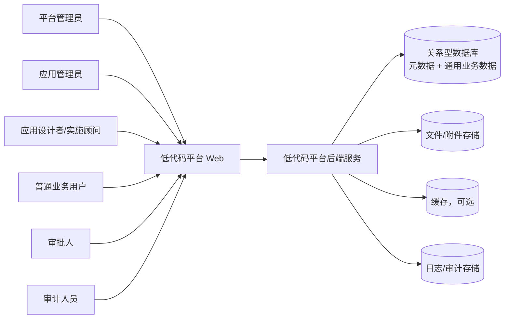
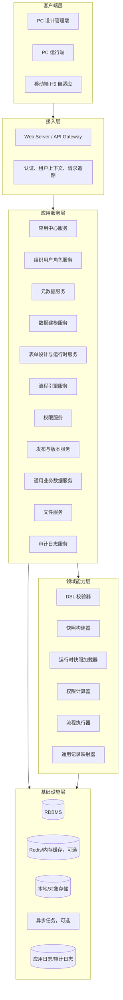
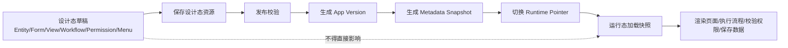
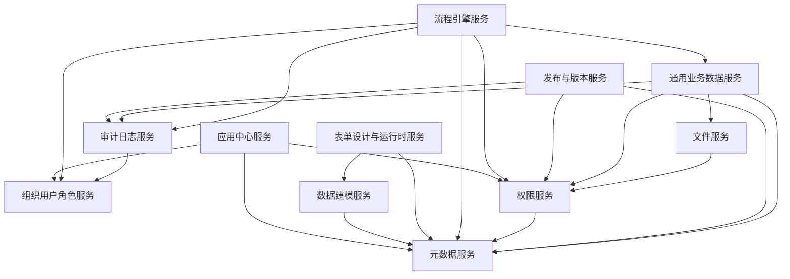
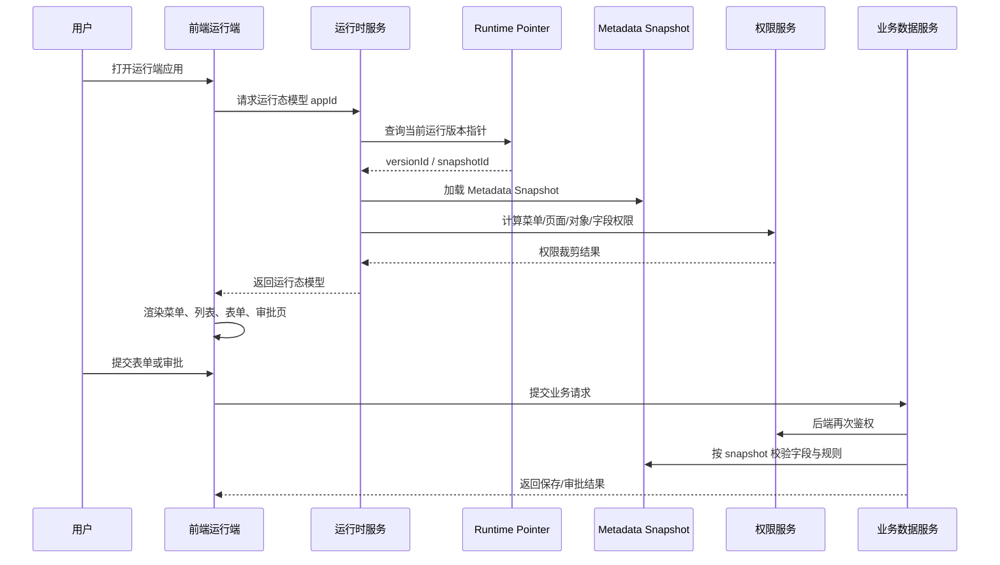
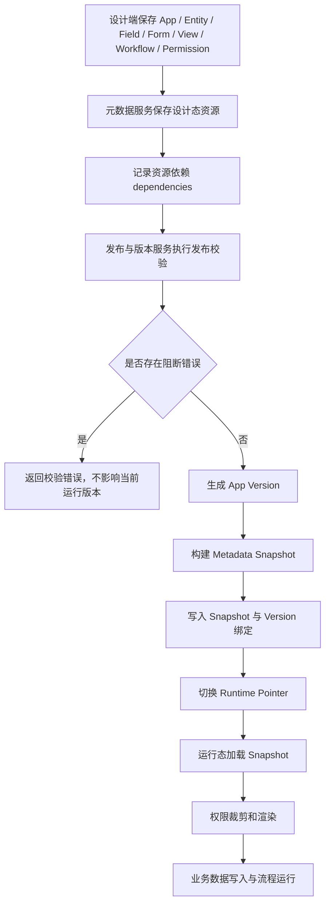
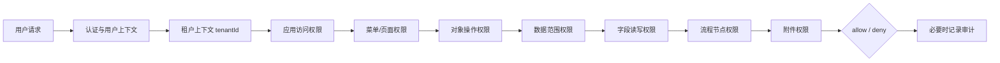
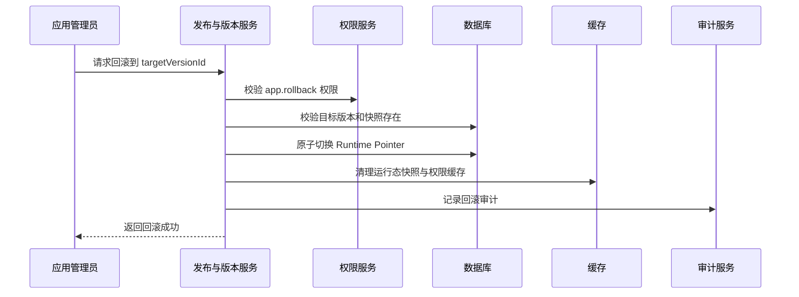
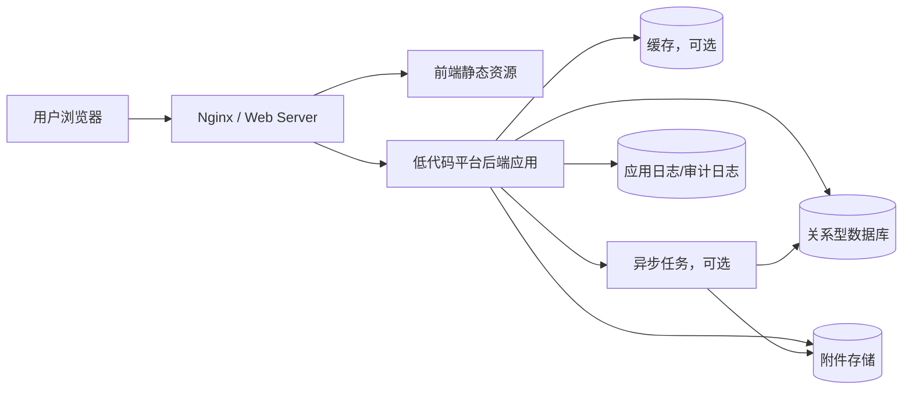

# 20-system-architecture-design.md

版本：v1.1  
适用范围：低代码平台 P0 系统架构、研发拆分、接口设计、数据库设计、运行时实现、部署实施、测试用例生成  
最后更新：2026-05-06  
状态：增强基线版

---

## 1. 文档目的

本文档用于定义低代码平台 P0 阶段的系统架构设计，承接 P0 主干需求文档与 `90-metadata-dsl-guideline.md`，为后续研发、数据库、API、测试、部署和 AI 生成代码提供统一架构基线。

本文档重点回答：

```text
1. P0 系统采用什么架构形态。
2. 设计态、发布态、运行态如何隔离。
3. 核心服务如何划分，服务边界如何定义。
4. 元数据、业务数据、权限、流程、文件和审计如何协同。
5. 发布快照、运行时渲染、权限校验、回滚如何实现。
6. 私有化单租户如何落地，SaaS 多租户如何预留。
7. 后续数据库设计、API 设计和代码生成必须遵守哪些约束。
```

本文档不是详细数据库设计文档，也不是接口实现文档。数据库表、字段、索引、约束和迁移策略将在 `30-core-database-design.md` 中细化；HTTP API 路径、请求响应、错误码和鉴权方式将在后续 API 设计文档中细化。

---

## 2. 架构设计目标

P0 架构目标不是一次性构建完整企业级低代码平台，而是保证三个样板应用能够稳定完成“设计、发布、运行、审批、留痕”的主闭环。

| 目标 | 说明 |
|---|---|
| 闭环可运行 | 支撑合同管理、费用报销、采购申请三个样板应用从搭建到运行的完整闭环。 |
| 元数据驱动 | 应用、对象、字段、表单、视图、流程、权限、菜单均以标准 DSL 描述。 |
| 设计运行隔离 | 设计态草稿不影响线上运行，运行态只读取已发布元数据快照。 |
| 后端可信 | 权限、字段、流程、数据范围、附件访问均由服务端强制校验。 |
| 数据可沉淀 | 使用通用业务记录模型承载动态对象数据，同时保留索引字段能力。 |
| 发布可追溯 | 每次发布生成不可变 App Version 与 Metadata Snapshot。 |
| 出错可回滚 | 当前运行版本指针可回滚到历史稳定版本，且不破坏历史业务数据。 |
| 可审计 | 配置、发布、权限、数据、流程、附件、导入导出、越权行为均可留痕。 |
| 可私有化交付 | P0 优先满足企业私有化单租户部署，降低运维复杂度。 |
| 可扩展演进 | 预留 tenantId、schemaVersion、snapshotId、resourceType 等扩展维度。 |

---

## 3. 架构设计原则

### 3.1 模块化单体优先原则

P0 后端采用“模块化单体优先”的架构形态：代码按领域模块拆分，物理部署可以先保持单个后端应用进程。

这样可以降低 P0 阶段的部署、事务、调试和交付复杂度，同时通过清晰模块边界为后续微服务化预留空间。

### 3.2 元数据优先原则

所有低代码配置必须以标准 DSL 保存，并遵守 `90-metadata-dsl-guideline.md` 中的公共头、命名、版本、校验、发布、快照和存储映射规则。

### 3.3 快照运行原则

运行态不得直接读取设计态草稿。运行端必须先解析当前应用的 Runtime Pointer，再加载 Runtime Pointer 指向的 Metadata Snapshot。

### 3.4 默认拒绝原则

任何未显式授权的访问、写入、审批、导出、发布、删除、回滚、附件下载和字段提交都必须默认拒绝。

### 3.5 后端强制原则

前端可以根据权限隐藏菜单、按钮、字段和数据，但这只是体验优化。所有核心权限和业务约束必须在后端重新校验。

### 3.6 不可信 DSL 原则

用户配置的 DSL 是数据，不是代码。P0 不允许执行用户输入的任意 JavaScript、Groovy、Python、SQL 片段或模板代码。

### 3.7 不可变发布原则

已经发布的 App Version 和 Metadata Snapshot 不得原地修改。后续修改必须形成新的发布版本或新的设计态草稿。

### 3.8 软删除与历史追溯原则

应用、元数据资源、字段、表单、流程、权限、业务数据、附件、流程实例默认采用软删除。已经产生历史数据或被快照引用的资源不得物理删除。

### 3.9 P0 可交付优先原则

P0 优先保障三类样板应用可交付。多租户 SaaS、完整 BPMN、复杂 BI、插件市场、AI 生成应用、原生移动 App 等能力只预留扩展点。

---

## 4. P0 架构范围

P0 系统架构覆盖以下能力：

| 范围 | 说明 |
|---|---|
| 应用中心 | 应用创建、分类、成员、入口、生命周期、模板创建、导入导出入口。 |
| 组织用户角色 | 租户、组织树、用户、角色、用户部门、用户角色、人员选择与审批处理人解析。 |
| 数据建模 | 业务对象、字段、子表、关联、字段类型、字段变更影响分析。 |
| 表单设计与运行时 | 表单设计、布局、组件绑定、字段规则、表单预览、运行态表单渲染。 |
| 视图/台账 | 列表、详情、查询、筛选、排序、基础台账入口。 |
| 流程引擎 | 轻量审批流定义、流程实例、任务、审批、驳回、撤回、作废、流程日志。 |
| 权限系统 | 平台级、应用级、对象级、数据级、字段级、流程节点级权限。 |
| 发布与版本 | 发布校验、版本生成、快照生成、运行指针切换、回滚。 |
| 元数据服务 | 统一保存与查询 Entity、Field、Form、View、Workflow、Permission、Menu 等 DSL。 |
| 通用业务数据服务 | 动态对象业务记录的保存、查询、编辑、软删除、状态流转、索引字段维护。 |
| 文件服务 | 附件上传、下载、预览、与记录/字段/流程关联、附件访问鉴权。 |
| 审计日志 | 配置、权限、发布、数据、流程、附件、导入导出、异常访问留痕。 |
| 私有化部署 | 单租户私有化部署、环境隔离、备份恢复、日志输出。 |
| SaaS 预留 | tenantId 全链路保留，多租户隔离点预留，不实现完整商业 SaaS。 |

---

## 5. P0 不做范围

P0 架构明确不覆盖以下完整能力，后续文档和代码生成不得隐式引入：

| 不做范围 | P0 处理方式 |
|---|---|
| 完整微服务治理 | 不做服务网格、注册中心、分布式链路治理和复杂服务编排。 |
| 分布式事务 | 不做跨服务 Saga、TCC、分布式事务协调器。 |
| 完整 BPMN 2.0 | 只做轻量企业审批流，不实现全量 BPMN 标准。 |
| 完整 BI / OLAP | 不做复杂多维分析、实时数仓、指标建模和自助 BI。 |
| 插件市场 | 不做第三方插件上架、审核、安装、计费和沙箱运行。 |
| 任意脚本执行 | 不允许用户输入脚本在服务端或前端运行。 |
| 完整 SaaS 运营后台 | 不做租户套餐、计费、开通、续费、运营控制台。 |
| 原生 App | 不做 iOS / Android 原生应用，只做移动端 H5 自适应。 |
| 深度外部集成 | 不实现企业微信、钉钉、飞书、ERP、财务系统的完整连接器。 |
| 动态物理建表 | 不为每个业务对象动态创建独立业务表。 |
| 复杂权限审批流 | 不做临时授权审批、授权委托链、岗位矩阵等复杂模型。 |

---

## 6. 总体架构图说明

### 6.1 系统上下文图



说明：

```text
1. Web 端包含平台管理、应用设计、应用运行、移动 H5 自适应页面。
2. 后端服务是唯一可信业务入口，前端不得直接访问数据库或附件存储。
3. 关系型数据库保存元数据、版本快照、通用业务数据、流程实例、权限、审计等核心数据。
4. 文件/附件存储只保存文件实体，附件访问必须经过后端鉴权。
5. 缓存仅用于运行态快照、权限结果、字典等性能优化，不是可信源。
```

### 6.2 总体分层架构图



### 6.3 架构图阅读顺序

```text
1. 设计者在设计端创建应用、对象、字段、表单、流程和权限。
2. 所有设计配置通过元数据服务保存为设计态资源。
3. 发布与版本服务读取设计态资源，执行校验后生成不可变快照。
4. 运行端访问应用时通过运行指针加载当前快照。
5. 前端运行时渲染器根据裁剪后的快照渲染页面。
6. 后端通用业务数据、流程、权限、文件、审计服务共同处理运行态请求。
```

---

## 7. 设计态 / 发布态 / 运行态分层

低代码平台必须区分设计态、发布态和运行态。这是 P0 架构的核心边界。

### 7.1 三态定义

| 分层 | 英文建议 | 定义 | 是否面向终端业务用户 |
|---|---|---|---:|
| 设计态 | Design Time | 应用搭建者编辑对象、字段、表单、流程、权限、菜单等草稿配置。 | 否 |
| 发布态 | Publish Time | 对设计态资源做完整性校验，生成 App Version 与 Metadata Snapshot。 | 否 |
| 运行态 | Runtime | 业务用户基于已发布快照访问应用、提交数据、处理审批。 | 是 |

### 7.2 设计态规则

```text
1. 设计态资源可以频繁保存、修改、删除和恢复。
2. 设计态资源保存不等于发布。
3. 设计态草稿不得直接影响运行态。
4. 设计态资源必须保存 schemaVersion、resourceType、version、status、dependencies。
5. 设计态保存时执行基础结构校验，发布时执行完整依赖校验。
```

### 7.3 发布态规则

```text
1. 发布态从设计态读取一组可发布资源。
2. 发布前必须校验应用、对象、字段、表单、视图、流程、权限、菜单的完整性。
3. 发布成功必须生成 App Version。
4. 发布成功必须生成 Metadata Snapshot。
5. 发布成功必须切换 Runtime Pointer。
6. 发布失败不得影响当前运行版本。
7. 发布操作必须记录审计日志。
```

### 7.4 运行态规则

```text
1. 运行态只读取 Runtime Pointer 指向的 Metadata Snapshot。
2. 运行态不得读取 draft 状态元数据。
3. 运行态所有请求必须有 tenantId、userId、appId、snapshotId 上下文。
4. 运行态前端可以基于权限裁剪渲染，但后端必须二次校验。
5. 已启动流程实例必须绑定启动时的 workflowVersionId / snapshotId。
6. 历史业务记录应能追溯创建或提交时使用的 appVersionId / snapshotId。
```

### 7.5 三态关系图



---

## 8. 前端架构

### 8.1 前端应用区域

P0 前端可以采用单一 Web 工程 + 多区域路由，也可以拆分为管理端和运行端两个工程。无论工程形态如何，逻辑区域必须清晰：

| 区域 | 路由建议 | 说明 |
|---|---|---|
| 登录与账户 | `/login`、`/account` | 登录、用户信息、退出。 |
| 平台管理端 | `/admin/*` | 组织、用户、角色、审计、系统配置。 |
| 应用中心 | `/apps` | 应用列表、分类、创建、模板入口、运行入口。 |
| 应用设计端 | `/designer/apps/:appId/*` | 应用配置、对象、表单、流程、权限、发布。 |
| 应用运行端 | `/runtime/apps/:appId/*` | 列表、详情、新增、编辑、审批、台账。 |
| 移动端 H5 | `/m/apps/:appId/*` | 运行端自适应页面，不做原生 App。 |

### 8.2 前端模块建议

```text
src/
  app/                     # 路由、启动、全局状态、错误边界
  shared/                  # API 客户端、组件、工具、权限 UI、错误码
  modules/
    app-center/            # 应用中心
    org-user-role/         # 组织用户角色
    data-modeling/         # 数据建模
    form-designer/         # 表单设计器
    workflow-designer/     # 流程设计器
    permission-center/     # 权限配置
    release-runtime/       # 发布与版本管理
    runtime-renderer/      # 运行态渲染器
    record-data/           # 运行态数据页面
    audit-log/             # 审计日志
```

### 8.3 前端核心职责

| 职责 | 说明 |
|---|---|
| API Client | 统一携带认证、租户上下文、请求 ID、分页、错误码。 |
| 设计器 UI | 提供对象、字段、表单、流程、权限配置界面。 |
| DSL 编辑与预览 | 在保存前做基础格式校验，在发布前展示后端校验结果。 |
| 运行态渲染器 | 根据后端返回的运行态模型渲染列表、详情、表单、审批页。 |
| 权限感知 UI | 根据后端返回权限隐藏或禁用菜单、按钮、字段。 |
| H5 自适应 | 对运行态表单与详情页做移动端响应式布局。 |
| 错误页 | 统一展示无权限、未发布、已停用、快照不存在、流程任务无效等状态。 |

### 8.4 前端不得承担的职责

```text
1. 不承担最终权限判断。
2. 不决定流程下一节点和处理人。
3. 不直接读取数据库或文件存储。
4. 不执行用户 DSL 中的任意脚本。
5. 不绕过后端直接拼装发布快照。
6. 不信任隐藏字段、禁用字段或前端裁剪字段作为安全控制。
```

---

## 9. 后端架构

### 9.1 后端工程形态

P0 推荐采用模块化单体工程：

```text
backend/
  interfaces/              # HTTP Controller / API 入参出参
  application/             # 应用服务，用例编排和事务边界
  domain/                  # 领域模型、领域服务、状态机、规则、校验器
  infrastructure/          # Repository、文件存储、缓存、任务、外部适配
  shared/                  # 租户上下文、用户上下文、错误码、审计上下文
  modules/
    app-center/
    org-user-role/
    metadata/
    data-modeling/
    form-runtime/
    workflow/
    permission/
    release-version/
    record-data/
    file/
    audit/
```

### 9.2 后端分层职责

| 层 | 职责 | 示例 |
|---|---|---|
| interfaces | HTTP API、参数解析、响应封装、基础鉴权注解 | `POST /api/apps` |
| application | 用例编排、事务边界、跨模块调用 | 发布应用、提交表单、审批通过 |
| domain | 领域规则、状态机、DSL 校验、权限计算 | 快照构建、流程节点流转 |
| infrastructure | 数据访问、文件存储、缓存、任务、适配器 | 保存元数据、上传附件 |
| shared | 上下文、错误码、分页、审计、工具 | `TenantContext`、`AuditContext` |

### 9.3 后端事务边界

| 用例 | 事务建议 |
|---|---|
| 创建应用 | 应用、默认成员、默认菜单、默认权限策略应同事务完成。 |
| 保存设计态资源 | 资源保存、依赖关系更新、审计记录建议同事务完成。 |
| 发布应用 | App Version、Metadata Snapshot、Runtime Pointer 切换应具备原子性。 |
| 提交业务数据 | 记录保存、索引字段维护、流程发起、审计日志应保持一致。 |
| 审批任务 | 任务状态、流程实例状态、业务记录状态回写、流程日志应保持一致。 |
| 回滚版本 | Runtime Pointer 切换、回滚记录、缓存失效、审计记录应保持一致。 |

### 9.4 领域事件建议

P0 可以先使用进程内事件或事务后回调，后续再升级为消息队列。

建议事件包括：

```text
AppCreated
MetadataResourceSaved
AppPublished
AppRolledBack
RuntimePointerChanged
BusinessRecordCreated
BusinessRecordUpdated
WorkflowStarted
WorkflowTaskCompleted
WorkflowInstanceFinished
PermissionChanged
AttachmentUploaded
UnauthorizedAccessDetected
```

---

## 10. 核心服务划分

P0 后端核心服务划分如下：

| 服务 | 模块编码建议 | 主要职责 |
|---|---|---|
| 应用中心服务 | app-center | 应用容器、分类、成员、状态、入口、导入导出入口。 |
| 组织用户角色服务 | org-user-role | 租户、组织、用户、角色、部门关系、角色关系、选择器。 |
| 元数据服务 | metadata | 统一保存和查询 DSL 资源、依赖关系、版本、Diff。 |
| 数据建模服务 | data-modeling | Entity、Field、Subtable、Lookup、字段影响分析。 |
| 表单设计与运行时服务 | form-runtime | Form DSL、组件、布局、规则、运行态表单模型。 |
| 流程引擎服务 | workflow | Workflow Definition、Instance、Task、审批流转和轨迹。 |
| 权限服务 | permission | 权限策略、权限合并、鉴权、字段权限、数据权限。 |
| 发布与版本服务 | release-version | 发布校验、版本、快照、运行指针、回滚。 |
| 审计日志服务 | audit | 配置审计、运行审计、权限审计、发布审计、安全审计。 |
| 文件服务 | file | 上传、下载、预览、绑定记录、附件鉴权。 |
| 通用业务数据服务 | record-data | 通用记录 CRUD、查询、状态、索引字段、软删除。 |

模块调用关系：



---

## 11. 元数据服务设计

### 11.1 服务职责

元数据服务是所有设计态 DSL 的统一存储与查询入口，负责管理 Entity、Field、Form、View、Workflow、Permission、Menu 等资源的公共能力。

### 11.2 不负责范围

```text
1. 不负责发布快照构建的最终编排，快照构建由发布与版本服务触发。
2. 不直接处理业务数据保存。
3. 不直接执行流程实例。
4. 不直接做运行态权限裁剪，但为权限服务提供策略 DSL。
```

### 11.3 核心输入

```text
tenantId
appId
resourceType
resourceKey
resourceName
schemaVersion
metadata
status
dependencies
```

### 11.4 核心输出

```text
metadataResource
metadataResourceList
resourceVersion
resourceDependencies
resourceDiff
validationResult
```

### 11.5 关键规则

```text
1. 同一 tenantId + appId + resourceType + resourceKey 必须唯一。
2. resourceKey 创建后原则上不可修改。
3. 保存设计态资源时必须执行基础 DSL 结构校验。
4. 资源之间的引用必须记录 dependencies，用于发布校验和影响分析。
5. 已进入发布快照的历史资源不得物理删除。
6. metadata JSON 只能保存声明式配置，不得保存可执行脚本。
```

### 11.6 后续数据库输入

```text
metadata_resource
metadata_resource_version
metadata_dependency
metadata_schema_registry
```

### 11.7 后续 API 输入

```text
POST   /api/apps/{appId}/metadata/resources
GET    /api/apps/{appId}/metadata/resources
GET    /api/apps/{appId}/metadata/resources/{resourceId}
PUT    /api/apps/{appId}/metadata/resources/{resourceId}
DELETE /api/apps/{appId}/metadata/resources/{resourceId}
GET    /api/apps/{appId}/metadata/resources/{resourceId}/diff
POST   /api/apps/{appId}/metadata/resources/validate
```

---

## 12. 应用中心服务设计

### 12.1 服务职责

应用中心服务负责低代码应用的顶层容器管理，包括应用创建、分类、基础信息、成员入口、设计入口、运行入口、状态生命周期和导入导出入口。

### 12.2 不负责范围

```text
1. 不负责具体表单、流程、权限、数据对象 DSL 的内部规则。
2. 不负责运行态页面渲染。
3. 不负责业务数据 CRUD。
4. 不负责文件实体存储。
```

### 12.3 核心输入

```text
appName
appKey
appIcon
appDescription
categoryId
ownerUserId
createMode: blank | template | import
templateKey
metadataPackage
```

### 12.4 核心输出

```text
app
appList
appSummary
appMemberList
appStatus
appEntry
```

### 12.5 关键规则

```text
1. appKey 在同一 tenantId 内必须唯一。
2. 应用是对象、表单、视图、流程、权限、版本、数据的顶层容器。
3. 应用删除必须软删除，不得删除已产生业务数据和发布历史。
4. 已停用应用运行入口关闭，但设计和管理入口可按权限保留。
5. 模板创建应用时必须生成新的 appId，并处理 resourceKey 冲突。
6. 应用中心列表必须按用户权限返回可见应用。
```

### 12.6 后续数据库输入

```text
app
app_category
app_member
app_import_export_job
app_template_install_log
```

### 12.7 后续 API 输入

```text
POST   /api/apps
GET    /api/apps
GET    /api/apps/{appId}
PUT    /api/apps/{appId}
POST   /api/apps/{appId}/disable
POST   /api/apps/{appId}/enable
DELETE /api/apps/{appId}
POST   /api/apps/{appId}/restore
GET    /api/apps/{appId}/entries
POST   /api/apps/import
POST   /api/apps/{appId}/export
```

---

## 13. 组织用户角色服务设计

### 13.1 服务职责

组织用户角色服务提供平台身份与组织基础能力，是权限、流程、人员字段、部门字段、审计和数据范围计算的依赖服务。

### 13.2 不负责范围

```text
1. 不负责具体业务对象的数据权限策略配置。
2. 不负责审批任务本身的状态流转。
3. 不负责外部身份源的复杂同步，P0 可预留但不完整实现。
```

### 13.3 核心输入

```text
tenantId
orgUnitName
orgUnitCode
parentOrgUnitId
userName
loginAccount
email
mobile
roleName
roleCode
userOrgRelation
userRoleRelation
```

### 13.4 核心输出

```text
orgTree
userProfile
userList
roleList
principalList
userContext
approverResolveResult
```

### 13.5 关键规则

```text
1. 用户必须归属 tenantId。
2. 组织树需要支持本部门、本部门及下级的数据范围计算。
3. 角色是权限分配载体，不等同于岗位或职级。
4. 用户停用后不得登录，不得被分配新的审批任务。
5. 流程处理人规则需要支持发起人、指定用户、指定角色、部门负责人等 P0 能力。
6. 审计日志中必须能解析操作人、所属组织和角色上下文。
```

### 13.6 后续数据库输入

```text
tenant
org_unit
user
role
user_org_unit
user_role
role_permission_binding
```

### 13.7 后续 API 输入

```text
GET    /api/org-units/tree
POST   /api/org-units
PUT    /api/org-units/{orgUnitId}
POST   /api/users
GET    /api/users
PUT    /api/users/{userId}
POST   /api/roles
GET    /api/roles
PUT    /api/roles/{roleId}
GET    /api/principals/search
POST   /api/approvers/resolve
```

---

## 14. 数据建模服务设计

### 14.1 服务职责

数据建模服务负责业务对象 Entity、字段 Field、子表 Subtable、关联 Lookup 等建模能力，并将建模结果保存为标准元数据 DSL。

### 14.2 不负责范围

```text
1. 不动态创建每个业务对象对应的独立物理表。
2. 不实现复杂多对多关系、跨对象事务编排和高级数据血缘。
3. 不直接负责表单 UI 渲染，但为表单提供字段模型。
```

### 14.3 核心输入

```text
entityKey
entityName
primaryFieldKey
fieldKey
fieldName
fieldType
isRequired
isUnique
defaultValue
validationRules
subtableConfig
lookupConfig
```

### 14.4 核心输出

```text
entityDsl
fieldDsl
entityDependency
impactAnalysis
publishValidationResult
```

### 14.5 关键规则

```text
1. 同一 Entity 下 fieldKey 必须唯一。
2. 字段类型必须来自 P0 支持清单。
3. 已被表单、视图、流程、权限、历史数据引用的字段不得直接物理删除。
4. 字段变更必须执行影响分析。
5. 必填字段若进入发布版本，运行态必须在后端校验。
6. 子表 P0 优先作为字段类型或子对象处理，不实现无限嵌套。
7. Lookup P0 支持单条关联，不做复杂多对多。
```

### 14.6 后续数据库输入

```text
metadata_resource(resource_type = entity)
metadata_resource(resource_type = field)
entity_runtime_index_config
field_change_log
```

业务数据仍进入通用记录表，不为每个 Entity 创建独立业务表。

### 14.7 后续 API 输入

```text
POST   /api/apps/{appId}/entities
GET    /api/apps/{appId}/entities
PUT    /api/apps/{appId}/entities/{entityId}
DELETE /api/apps/{appId}/entities/{entityId}
POST   /api/apps/{appId}/entities/{entityId}/fields
PUT    /api/apps/{appId}/entities/{entityId}/fields/{fieldId}
DELETE /api/apps/{appId}/entities/{entityId}/fields/{fieldId}
POST   /api/apps/{appId}/entities/{entityId}/impact-analysis
```

---

## 15. 表单设计与运行时服务设计

### 15.1 服务职责

表单设计与运行时服务负责表单 DSL、组件布局、字段绑定、显隐规则、校验规则、子表组件、附件组件和运行态表单模型输出。

### 15.2 不负责范围

```text
1. 不负责字段本身的创建和类型定义。
2. 不负责最终业务数据保存，业务数据保存由通用业务数据服务处理。
3. 不负责最终权限判断，字段权限必须由权限服务计算并由后端强校验。
```

### 15.3 核心输入

```text
formKey
formName
entityKey
layout
components
fieldBindings
visibilityRules
validationRules
mode: create | edit | view | approve
```

### 15.4 核心输出

```text
formDsl
formPreviewModel
runtimeFormModel
fieldValidationResult
formDependency
```

### 15.5 关键规则

```text
1. 表单必须绑定有效 Entity。
2. 表单组件绑定字段必须存在且字段类型匹配。
3. 新增/编辑/查看/审批模式可以共享表单 DSL，但运行态必须按权限和模式裁剪。
4. 必填、格式、范围、枚举等校验必须在后端再次执行。
5. 前端隐藏字段不得作为后端免校验依据。
6. 审批节点字段权限可以覆盖普通编辑权限，但不得扩大到未授权数据范围。
7. 附件组件必须通过文件服务上传和下载。
```

### 15.6 后续数据库输入

```text
metadata_resource(resource_type = form)
metadata_dependency(form -> entity/field/workflow)
form_runtime_cache，可选
```

### 15.7 后续 API 输入

```text
POST   /api/apps/{appId}/forms
GET    /api/apps/{appId}/forms
PUT    /api/apps/{appId}/forms/{formId}
DELETE /api/apps/{appId}/forms/{formId}
POST   /api/apps/{appId}/forms/{formId}/preview
GET    /api/runtime/apps/{appId}/forms/{formKey}
POST   /api/runtime/apps/{appId}/forms/{formKey}/validate
```

---

## 16. 流程引擎服务设计

### 16.1 服务职责

流程引擎服务负责轻量企业审批流的定义、发布引用、实例启动、任务生成、审批处理、驳回、撤回、作废、流程日志和流程状态回写。

### 16.2 不负责范围

```text
1. 不实现完整 BPMN 2.0。
2. 不实现复杂会签、并行网关、加签、转交等 P0 外能力。
3. 不直接绕过业务数据服务修改业务记录。
4. 不负责组织用户基础数据维护。
```

### 16.3 核心输入

```text
workflowKey
entityKey
startNode
approvalNodes
conditionBranches
assigneeRules
nodeFieldPermissions
recordId
submitterId
action: approve | reject | withdraw | void
comment
```

### 16.4 核心输出

```text
workflowDefDsl
workflowInstance
taskInstance
workflowTrace
nextTaskList
workflowStatus
```

### 16.5 关键规则

```text
1. 启动流程时必须绑定当前 appVersionId、snapshotId、workflowVersionId。
2. 已启动流程实例不受后续流程定义发布影响。
3. 审批处理人必须由服务端根据组织、角色、节点规则解析。
4. 审批动作必须校验当前用户是否为有效任务处理人。
5. 审批提交字段必须按节点字段权限校验。
6. 流程状态变化必须回写业务记录状态。
7. 每个流程动作必须记录流程日志和审计日志。
```

### 16.6 后续数据库输入

```text
workflow_instance
workflow_task
workflow_task_action
workflow_trace
workflow_runtime_binding
```

### 16.7 后续 API 输入

```text
POST   /api/runtime/apps/{appId}/records/{recordId}/workflow/start
GET    /api/runtime/tasks/todo
GET    /api/runtime/tasks/done
POST   /api/runtime/tasks/{taskId}/approve
POST   /api/runtime/tasks/{taskId}/reject
POST   /api/runtime/workflows/{instanceId}/withdraw
POST   /api/runtime/workflows/{instanceId}/void
GET    /api/runtime/workflows/{instanceId}/trace
```

---

## 17. 权限服务设计

### 17.1 服务职责

权限服务负责统一权限策略管理、权限合并、运行态鉴权、字段权限、数据权限、流程节点权限和权限缓存失效。

### 17.2 不负责范围

```text
1. 不负责组织、用户、角色基础数据维护。
2. 不负责业务数据存储，但负责输出数据过滤条件。
3. 不负责前端 UI 渲染，但提供前端可用的权限裁剪结果。
```

### 17.3 核心输入

```text
userContext
principalList
resourceType
resourceId / resourceKey
action
entityKey
recordId
fieldKey
snapshotId
permissionPolicyDsl
```

### 17.4 核心输出

```text
permissionDecision: allow | deny
allowedActions
fieldPermissionMap
dataScopeFilter
menuPermissionTree
runtimePermissionContext
```

### 17.5 权限层级

P0 权限至少覆盖：

```text
平台级权限
应用级权限
菜单/页面级权限
对象级权限
数据级权限
字段级权限
流程级权限
流程节点字段权限
导入导出权限
附件访问权限
审计查看权限
```

### 17.6 关键规则

```text
1. 默认拒绝，未配置或无法解析时不得放行。
2. 后端必须在每次关键操作执行前鉴权。
3. 数据权限必须转换为服务端查询过滤条件，不得只在前端过滤。
4. 字段权限必须同时作用于读取响应和写入请求。
5. 流程节点字段权限只在当前任务上下文内生效。
6. 权限策略变更必须记录审计，并使相关缓存失效。
7. 附件下载必须校验应用权限、记录权限和字段/附件权限。
```

### 17.7 后续数据库输入

```text
permission_policy
permission_assignment
permission_effective_cache，可选
permission_change_log
```

### 17.8 后续 API 输入

```text
POST   /api/apps/{appId}/permissions/policies
GET    /api/apps/{appId}/permissions/policies
PUT    /api/apps/{appId}/permissions/policies/{policyId}
POST   /api/permissions/evaluate
POST   /api/permissions/batch-evaluate
GET    /api/runtime/apps/{appId}/permissions/me
```

---

## 18. 发布与版本服务设计

### 18.1 服务职责

发布与版本服务负责从设计态到运行态的稳定交付，包括发布校验、版本生成、快照构建、运行时指针切换、版本查看、停用和回滚。

### 18.2 不负责范围

```text
1. 不负责设计态资源的日常编辑，编辑由各设计服务和元数据服务完成。
2. 不负责具体业务数据 CRUD。
3. 不实现复杂灰度发布、环境流水线和 DevOps 审批。
```

### 18.3 核心输入

```text
appId
publishNote
publisherId
selectedResourceSet，可选
validateOnly，可选
rollbackTargetVersionId，可选
```

### 18.4 核心输出

```text
publishValidationResult
appVersion
metadataSnapshot
runtimePointer
publishLog
rollbackLog
```

### 18.5 版本状态机

```text
draft
  → validating
  → publish_failed | published
published
  → active
  → inactive
active
  → rolled_back_from
```

说明：

```text
1. draft 是设计态应用状态，不是运行版本。
2. published 表示版本生成成功。
3. active 表示 Runtime Pointer 当前指向该版本。
4. inactive 表示历史发布版本可查看、可回滚。
5. rolled_back_from 表示该版本曾经作为回滚前版本被替换，仍不可变。
```

### 18.6 关键规则

```text
1. 发布前必须执行阻断错误校验。
2. 发布快照必须包含运行所需完整元数据，不依赖草稿资源。
3. App Version 与 Metadata Snapshot 创建成功后才允许切换 Runtime Pointer。
4. Runtime Pointer 切换必须原子化。
5. 发布失败不得影响当前运行版本。
6. 回滚只是切换 Runtime Pointer，不修改历史快照。
7. 发布和回滚都必须记录审计和缓存失效。
```

### 18.7 后续数据库输入

```text
app_version
metadata_snapshot
app_runtime_pointer
publish_log
rollback_log
```

### 18.8 后续 API 输入

```text
POST   /api/apps/{appId}/publish/validate
POST   /api/apps/{appId}/publish
GET    /api/apps/{appId}/versions
GET    /api/apps/{appId}/versions/{versionId}
GET    /api/apps/{appId}/snapshots/{snapshotId}
POST   /api/apps/{appId}/rollback
GET    /api/runtime/apps/{appId}/snapshot
```

---

## 19. 审计日志服务设计

### 19.1 服务职责

审计日志服务负责记录平台关键操作、安全事件、权限变更、发布回滚、业务数据变更、流程动作、附件访问和导入导出行为。

### 19.2 不负责范围

```text
1. 不替代业务数据表本身的状态字段。
2. 不承担复杂 SIEM、风控分析和长期归档分析平台。
3. 不作为普通业务查询的唯一来源。
```

### 19.3 核心输入

```text
tenantId
appId
operatorId
operatorName
operationType
resourceType
resourceId
recordId
snapshotId
requestId
ip
userAgent
beforeValue
afterValue
result
errorCode
```

### 19.4 核心输出

```text
auditLog
auditLogList
auditDetail
securityEvent
```

### 19.5 P0 审计事件清单

```text
登录成功 / 登录失败
创建、编辑、停用、删除、恢复应用
保存对象、字段、表单、流程、权限策略
发布应用、发布失败、回滚版本
创建、编辑、删除、作废、导入、导出业务记录
发起流程、审批、驳回、撤回、作废
上传、下载、预览、删除附件
权限策略变更、成员变更、角色变更
越权访问、越权字段提交、无效快照访问
```

### 19.6 关键规则

```text
1. 审计日志应尽量在主事务内或事务成功后可靠写入。
2. 发布、回滚、权限变更、审批动作、越权行为必须审计。
3. 审计日志不得保存明文敏感字段值，必要时脱敏或摘要化。
4. 审计日志必须包含 tenantId、operatorId、operationType、resourceType、result。
5. 审计日志查询本身也需要权限控制。
```

### 19.7 后续数据库输入

```text
audit_log
audit_log_detail
security_event
```

### 19.8 后续 API 输入

```text
GET /api/audit/logs
GET /api/audit/logs/{auditLogId}
GET /api/apps/{appId}/audit/logs
```

---

## 20. 文件服务设计

### 20.1 服务职责

文件服务负责附件上传、下载、预览、删除、与业务记录/字段/流程的绑定，以及附件访问鉴权。

### 20.2 不负责范围

```text
1. 不负责业务数据状态流转。
2. 不直接暴露永久无鉴权下载地址。
3. 不实现复杂文档在线编辑、全文检索和 DLP。
```

### 20.3 核心输入

```text
file
fileName
fileSize
mimeType
appId
entityKey
recordId
fieldKey
workflowInstanceId
taskId
```

### 20.4 核心输出

```text
fileId
attachmentId
fileMeta
temporaryDownloadUrl，可选
previewUrl，可选
```

### 20.5 关键规则

```text
1. 附件元数据必须入库，文件实体存储在本地目录或对象存储。
2. 附件必须绑定 tenantId，必要时绑定 appId、recordId、fieldKey。
3. 下载和预览必须经过后端鉴权。
4. 临时访问链接必须短有效期，不得使用永久公开链接。
5. 业务记录软删除时附件默认保留并标记不可见或随记录进入回收态。
6. 附件操作必须记录审计。
```

### 20.6 后续数据库输入

```text
file_object
file_attachment
file_access_log
```

### 20.7 后续 API 输入

```text
POST   /api/files/upload
GET    /api/files/{fileId}
GET    /api/files/{fileId}/download
GET    /api/files/{fileId}/preview
DELETE /api/files/{fileId}
POST   /api/runtime/apps/{appId}/records/{recordId}/attachments
```

---

## 21. 通用业务数据服务设计

### 21.1 服务职责

通用业务数据服务负责低代码动态对象的业务记录保存、查询、编辑、删除、状态流转、索引字段维护和与流程、附件、审计的协同。

### 21.2 不负责范围

```text
1. 不为每个 Entity 动态创建独立物理表。
2. 不直接绕过权限服务返回数据。
3. 不直接执行流程下一节点判断。
4. 不承担复杂 BI 聚合和数仓加工。
```

### 21.3 核心输入

```text
appId
entityKey
recordId
snapshotId
formKey
recordDataJson
subtableData
attachmentRefs
operation: create | update | delete | submit | void | archive
```

### 21.4 核心输出

```text
businessRecord
recordList
recordDetail
recordStatus
validationResult
indexFieldValues
```

### 21.5 记录生命周期

```text
draft
  → submitted
  → running
  → approved
  → rejected
  → withdrawn
  → voided
  → archived
  → deleted
```

非流程对象可以从 draft 直接进入 approved 或 active 类业务状态，但状态码必须与统一状态模型兼容。

### 21.6 关键规则

```text
1. 写入业务记录前必须加载运行态快照。
2. 写入业务记录前必须执行对象权限、数据权限、字段权限校验。
3. 写入字段必须来自快照中的合法字段定义。
4. 必填、唯一、格式、枚举、数值范围必须后端校验。
5. recordDataJson 保存完整业务字段，索引字段保存高频查询字段的冗余值。
6. 业务记录必须保存 appVersionId / snapshotId，用于历史追溯。
7. 软删除不得破坏流程历史和附件历史。
```

### 21.7 后续数据库输入

```text
business_record
business_record_index
business_record_relation
business_record_change_log
business_record_attachment
```

### 21.8 后续 API 输入

```text
POST   /api/runtime/apps/{appId}/entities/{entityKey}/records
GET    /api/runtime/apps/{appId}/entities/{entityKey}/records
GET    /api/runtime/apps/{appId}/entities/{entityKey}/records/{recordId}
PUT    /api/runtime/apps/{appId}/entities/{entityKey}/records/{recordId}
DELETE /api/runtime/apps/{appId}/entities/{entityKey}/records/{recordId}
POST   /api/runtime/apps/{appId}/entities/{entityKey}/records/{recordId}/submit
POST   /api/runtime/apps/{appId}/entities/{entityKey}/records/{recordId}/void
```

---

## 22. 运行时渲染机制

### 22.1 运行时渲染目标

运行时渲染机制用于将已发布 Metadata Snapshot 转换为用户可访问的列表、详情、表单、审批页和菜单。

### 22.2 渲染链路



### 22.3 运行态模型组成

```text
appInfo
runtimeVersion
snapshotId
menuTree
viewModel
formModel
fieldModel
workflowModel
permissionContext
uiActions
dictOptions
```

### 22.4 关键规则

```text
1. 前端运行态模型必须来自后端，不得直接读取草稿 DSL。
2. 后端返回给前端前可以先按权限裁剪菜单、按钮、字段和视图列。
3. 前端渲染结果不是可信安全边界。
4. 表单提交、记录查询、流程审批、附件下载必须后端再次校验。
5. 快照加载失败时必须返回明确错误，不得静默回退到草稿。
6. H5 与 PC 应共享同一套运行态模型，只在布局适配上差异化。
```

---

## 23. 设计态到运行态的数据流

### 23.1 数据流总览



### 23.2 设计态保存数据流

```text
1. 前端设计器提交 DSL 草稿。
2. 后端识别 resourceType 和 schemaVersion。
3. 元数据服务执行结构校验。
4. 元数据服务保存 metadata_resource。
5. 元数据服务更新依赖关系。
6. 审计日志记录配置变更。
```

### 23.3 发布态数据流

```text
1. 发布服务收集应用内有效设计态资源。
2. 执行对象、字段、表单、视图、流程、权限和菜单校验。
3. 构建完整 metadataSnapshot。
4. 写入 appVersion。
5. 写入 metadataSnapshot。
6. 原子切换 appRuntimePointer。
7. 清理运行态缓存。
8. 记录发布审计。
```

### 23.4 运行态数据流

```text
1. 运行端请求应用运行模型。
2. 后端根据 appRuntimePointer 获取 snapshotId。
3. 加载 metadataSnapshot。
4. 权限服务根据用户上下文裁剪模型。
5. 前端运行渲染器渲染页面。
6. 用户提交数据或审批动作。
7. 后端基于 snapshot 和权限重新校验。
8. 写入业务记录、流程实例、审计日志。
```

---

## 24. 权限校验链路

### 24.1 权限校验总链路



### 24.2 不同操作的最小校验

| 操作 | 必须校验 |
|---|---|
| 进入应用 | 登录、tenantId、app.view、应用状态、运行版本是否存在。 |
| 打开列表 | app.view、menu.view、entity.view、数据范围。 |
| 查看详情 | entity.view、数据范围、字段可见权限。 |
| 新增记录 | entity.create、字段可编辑、必填校验、表单模式。 |
| 编辑记录 | entity.update、数据范围、字段可编辑、记录状态。 |
| 删除/作废 | entity.delete 或 entity.void、数据范围、记录状态。 |
| 发起流程 | workflow.start、entity.submit、字段权限、流程定义有效。 |
| 审批任务 | task.assignee、workflow.approve、节点字段权限、任务状态。 |
| 导出数据 | entity.export、数据范围、字段可导出权限。 |
| 下载附件 | app.view、record.view、field.view 或 attachment.view。 |
| 发布应用 | app.publish、发布校验通过、应用未删除。 |
| 回滚版本 | app.rollback、目标版本有效、快照存在。 |

### 24.3 权限拒绝处理

```text
1. 返回统一错误码，例如 PERMISSION_DENIED。
2. 不泄露无权限资源的敏感字段。
3. 对越权提交、越权下载、越权审批等安全事件记录审计。
4. 前端展示无权限提示或隐藏入口，但不得自行重试绕过。
```

---

## 25. 发布快照机制

### 25.1 快照定义

Metadata Snapshot 是一次发布时固化的完整运行态元数据包，包含运行端所需的应用、对象、字段、表单、视图、流程、权限、菜单等配置。

### 25.2 快照内容

```text
snapshotHeader
app
entities
fields
forms
views
workflows
permissionPolicies
menus
runtimeSettings
dependencies
schemaVersion
buildInfo
```

### 25.3 快照构建规则

```text
1. 快照由发布服务构建，不由前端提交完整快照。
2. 快照必须来自当前设计态有效资源。
3. 快照生成前必须执行阻断错误校验。
4. 快照必须去除设计器临时字段和 UI 辅助状态。
5. 快照必须包含运行态依赖的完整引用关系。
6. 快照一旦发布成功不得原地修改。
7. 快照必须保存 hash 或 checksum，便于一致性校验。
```

### 25.4 快照与业务数据关系

```text
1. 新建业务记录时记录当前 snapshotId。
2. 发起流程时流程实例绑定当前 snapshotId。
3. 查询历史记录时可按当前权限展示，但应保留历史字段解释能力。
4. 历史快照不得因当前设计态变更而被覆盖。
```

---

## 26. 回滚机制

### 26.1 回滚定义

回滚是将应用当前 Runtime Pointer 从当前版本切换到某个历史稳定版本。回滚不修改历史 Metadata Snapshot，不删除当前版本，也不回写设计态草稿。

### 26.2 回滚流程



### 26.3 回滚规则

```text
1. 只能回滚到成功发布且快照存在的历史版本。
2. 回滚不影响已经启动的流程实例，它们继续使用启动时绑定的 snapshotId。
3. 回滚后新进入运行端的用户读取回滚目标版本。
4. 回滚必须记录操作人、时间、原版本、目标版本、原因。
5. 回滚失败不得影响当前 Runtime Pointer。
6. 回滚不自动覆盖设计态草稿。如需继续基于历史版本编辑，应另行提供“从版本恢复设计态”的 P1 能力，P0 不要求。
```

---

## 27. 私有化单租户部署架构

### 27.1 P0 推荐部署形态



### 27.2 最小部署组件

```text
1. Web Server / Nginx
2. 前端静态资源
3. 后端应用服务
4. 关系型数据库
5. 文件/附件存储目录或对象存储
6. 应用日志与审计日志存储
```

可选组件：

```text
1. Redis 或兼容缓存
2. 异步任务 Worker
3. 定时备份任务
4. 监控告警组件
```

### 27.3 部署约束

```text
1. P0 可以一个部署实例服务一个企业客户或一个内部环境。
2. dev / test / prod 必须使用独立数据库、附件目录和配置。
3. 数据库备份和附件备份必须匹配时间点，避免记录与附件不一致。
4. 文件下载必须经过后端鉴权，不得直接暴露文件目录。
5. 缓存故障不得导致数据错误，只能导致性能下降或明确降级。
6. 运行态快照缓存必须可重建。
```

---

## 28. SaaS 多租户预留设计

P0 不实现完整商业 SaaS，但必须在架构和数据模型中保留多租户演进基础。

### 28.1 必须预留

```text
1. 所有核心表保留 tenant_id。
2. 所有核心 DSL 公共头保留 tenantId。
3. API 请求上下文保留 tenantId。
4. 缓存 Key 包含 tenantId。
5. 文件路径或对象存储 Key 包含 tenantId。
6. 审计日志包含 tenantId。
7. Runtime Pointer、Metadata Snapshot、Business Record 均包含 tenantId。
8. 后台任务必须携带 tenantId 上下文。
```

### 28.2 P0 不实现

```text
1. 租户开通、停用、套餐、配额、计费。
2. 跨租户运营管理控制台。
3. 多租户资源计量和限流策略。
4. 租户自定义域名和品牌配置。
5. 跨租户数据迁移和租户级数据归档。
```

### 28.3 演进注意事项

```text
1. 后续 SaaS 化时，必须先完成 tenantId 强校验和数据隔离审计。
2. 当前 P0 代码不得硬编码单租户默认值到领域逻辑中。
3. 可以在私有化配置中使用 t_default，但数据库和 API 仍保留 tenantId 字段。
```

---

## 29. 技术选型建议

技术选型以“团队熟悉、稳定、易交付、可私有化部署”为优先原则。以下为建议，不强制绑定唯一技术栈。

| 层级 | 建议选型 | 说明 |
|---|---|---|
| 前端框架 | React / Vue | 选择团队更熟悉的一种；设计器和运行端共享元数据解释模型。 |
| 前端状态 | Redux Toolkit / Zustand / Pinia | 用于设计态草稿、运行态模型和权限上下文管理。 |
| UI 组件 | Ant Design / Element Plus / 企业内部组件库 | 需支持复杂表单、表格、弹窗、树、选择器。 |
| 表单渲染 | 自研轻量渲染器 | 运行态必须基于 Metadata Snapshot，不依赖设计器内部状态。 |
| 后端框架 | Spring Boot / NestJS / Go Web 框架 | P0 推荐模块化单体，要求分层清晰、事务可靠、生态成熟。 |
| 数据库 | PostgreSQL 优先，MySQL 可选 | 需要 JSON 字段、事务、索引、全文/模糊查询基础能力。 |
| 缓存 | Redis 可选 | 用于快照、权限、字典缓存；不得作为唯一可信源。 |
| 文件存储 | 本地文件存储 + 对象存储适配层 | P0 私有化可先本地，架构必须预留对象存储。 |
| API 风格 | REST + JSON | P0 优先 REST，后续可按需引入 GraphQL 或事件 API。 |
| 认证 | Session / JWT 均可 | 必须形成统一用户上下文和租户上下文。 |
| 日志 | 应用日志 + 审计日志分离 | 审计日志应结构化保存到数据库或专用审计表。 |
| 部署 | Nginx + 后端服务 + RDBMS + 文件存储 | P0 不要求 Kubernetes，但建议支持容器化。 |

### 29.1 数据库选型注意事项

```text
1. 如果选择 PostgreSQL，可充分利用 jsonb 和 GIN 索引能力。
2. 如果选择 MySQL，应明确 JSON 查询和索引字段冗余策略。
3. 不论选择哪种数据库，高频筛选字段都应冗余到 business_record_index 或固定索引列。
4. 不得依赖数据库动态建表实现低代码对象。
```

### 29.2 缓存选型注意事项

```text
1. 快照缓存 Key：tenantId + appId + snapshotId。
2. 权限缓存 Key：tenantId + userId + appId + snapshotId。
3. 发布、回滚、权限变更必须清理相关缓存。
4. 缓存穿透时必须回源数据库并重新构建，不得返回草稿数据。
```

---

## 30. 非功能架构要求

### 30.1 性能要求

| 场景 | P0 建议目标 |
|---|---|
| 应用中心列表 | 常规租户应用数量下 1 秒内返回。 |
| 运行态快照加载 | 命中缓存 200ms 级；未命中时可接受较慢但需明确监控。 |
| 列表查询 | 支持分页，禁止一次性返回大量记录。 |
| 表单提交 | 常规字段和子表规模下 2 秒内完成。 |
| 审批提交 | 常规流程节点下 2 秒内完成。 |
| 附件上传 | 受文件大小影响，应支持大小限制和失败重试提示。 |

### 30.2 可用性要求

```text
1. 发布失败不得影响当前运行版本。
2. 回滚失败不得影响当前运行版本。
3. 快照缓存失效后可从数据库重建。
4. 附件存储失败不得造成业务记录误成功。
5. 审计日志失败应有补偿或错误告警，不应静默丢失关键审计。
```

### 30.3 安全要求

```text
1. 所有 API 必须认证，公开资源除外但 P0 原则上不开放匿名运行端。
2. 服务端必须强制权限校验。
3. DSL 不允许任意脚本执行。
4. 附件下载必须鉴权。
5. 敏感审计字段必须脱敏。
6. 防止越权字段提交、水平越权和跨租户访问。
7. 导入文件必须做类型、大小和内容校验。
```

### 30.4 可维护性要求

```text
1. 领域模块边界清晰。
2. 状态码、错误码、权限动作码统一。
3. DSL schemaVersion 可演进。
4. 数据库迁移脚本可重复执行和回滚。
5. 关键规则必须有单元测试和集成测试。
```

### 30.5 可观测性要求

```text
1. 请求必须有 requestId。
2. 发布、回滚、审批、导入导出必须有结构化日志。
3. 关键错误码必须可统计。
4. 快照加载、权限计算、表单提交、审批提交建议记录耗时。
```

---

## 31. 后续数据库设计输入

`30-core-database-design.md` 必须至少覆盖以下表或表组：

### 31.1 基础与应用

```text
tenant
app
app_category
app_member
```

### 31.2 组织用户角色

```text
org_unit
user
role
user_org_unit
user_role
```

### 31.3 元数据与发布

```text
metadata_resource
metadata_resource_version
metadata_dependency
metadata_snapshot
app_version
app_runtime_pointer
publish_log
rollback_log
```

### 31.4 权限

```text
permission_policy
permission_assignment
permission_change_log
permission_effective_cache，可选
```

### 31.5 业务数据

```text
business_record
business_record_index
business_record_relation
business_record_change_log
business_record_attachment
```

### 31.6 流程

```text
workflow_instance
workflow_task
workflow_task_action
workflow_trace
workflow_runtime_binding
```

### 31.7 文件与审计

```text
file_object
file_attachment
file_access_log
audit_log
audit_log_detail
security_event
```

### 31.8 数据库统一字段要求

所有核心表应优先包含：

```text
id
tenant_id
app_id，平台级表可为空
version
status
created_by
created_at
updated_by
updated_at
deleted_by
deleted_at
is_deleted
remark
```

### 31.9 关键数据库约束

```text
1. 不为每个业务对象生成独立业务表。
2. 元数据资源统一进入 metadata_resource。
3. 业务记录统一进入 business_record。
4. 高频查询字段通过索引表或固定索引列冗余。
5. app_version、metadata_snapshot、app_runtime_pointer 是发布运行机制必需表。
6. 已发布 snapshot 不可原地更新。
7. 所有核心查询必须带 tenant_id。
```

---

## 32. 后续 API 设计输入

后续 API 设计必须按以下域拆分，避免接口混乱。

| API 域 | 说明 |
|---|---|
| `/api/apps` | 应用中心、分类、成员、入口、生命周期。 |
| `/api/org-units` | 组织树。 |
| `/api/users` | 用户管理。 |
| `/api/roles` | 角色管理。 |
| `/api/apps/{appId}/metadata` | 元数据资源保存、查询、校验。 |
| `/api/apps/{appId}/entities` | 数据建模。 |
| `/api/apps/{appId}/forms` | 表单设计。 |
| `/api/apps/{appId}/workflows` | 流程设计。 |
| `/api/apps/{appId}/permissions` | 权限策略配置。 |
| `/api/apps/{appId}/publish` | 发布校验与发布。 |
| `/api/apps/{appId}/versions` | 版本查询。 |
| `/api/runtime/apps/{appId}` | 运行态应用模型和入口。 |
| `/api/runtime/apps/{appId}/entities/{entityKey}/records` | 运行态业务数据。 |
| `/api/runtime/tasks` | 待办、已办、审批动作。 |
| `/api/files` | 文件上传、下载、预览。 |
| `/api/audit` | 审计日志查询。 |

### 32.1 API 统一要求

```text
1. API 示例使用 camelCase。
2. 数据库字段使用 snake_case。
3. 所有运行态 API 必须携带 appId，并在服务端解析 tenantId、userId、snapshotId。
4. 所有写操作必须有权限校验和审计策略。
5. 分页查询必须使用统一分页结构。
6. 错误响应必须包含 code、message、requestId。
7. 发布、回滚、审批、导入导出等关键 API 必须防重复提交。
```

### 32.2 API 禁止事项

```text
1. 运行态 API 不得读取 draft 元数据。
2. 前端不得提交完整 metadataSnapshot 让后端直接信任。
3. 业务数据 API 不得绕过权限服务。
4. 附件下载 API 不得返回永久无鉴权链接。
5. 权限 API 不得暴露用户无权查看的策略详情。
```

---

## 33. 给 AI 后续生成数据库/API/代码的约束

本章节为后续 AI 生成数据库、API、后端代码、前端代码、测试用例时的强约束。若与其他生成内容冲突，以本章节为准。

### 33.1 数据库生成约束

```text
1. 不得为每个业务对象生成独立业务表。
2. 必须生成 metadata_resource、metadata_snapshot、app_version、app_runtime_pointer。
3. 必须生成 business_record 或等价通用记录表。
4. 所有核心表必须保留 tenant_id。
5. 软删除必须使用 is_deleted + deleted_at + deleted_by。
6. 已发布快照不可原地修改。
7. 业务记录必须可追溯 app_version_id / snapshot_id。
8. 高频查询字段必须通过索引表或索引列处理，不得只依赖 JSON 全表扫描。
```

### 33.2 API 生成约束

```text
1. 运行态 API 不得读取草稿元数据。
2. 保存业务数据必须执行对象权限、数据权限和字段权限校验。
3. 审批 API 必须校验 taskId、处理人、任务状态、节点权限。
4. 附件下载 API 必须鉴权。
5. 发布 API 必须先执行发布校验。
6. 回滚 API 只能切换 Runtime Pointer，不得修改历史 Snapshot。
7. 所有写操作必须记录审计或声明不审计的理由。
8. API 响应不得泄露无权限字段。
```

### 33.3 后端代码生成约束

```text
1. 必须按模块化单体组织代码，不得把所有逻辑写入一个 Controller。
2. 权限不得只在前端实现。
3. DSL 必须按 resourceType + schemaVersion 校验。
4. 用户 DSL 不得执行任意脚本。
5. 发布、回滚、审批、提交表单必须有事务边界。
6. 流程实例必须绑定启动时 snapshotId。
7. 缓存 Key 必须包含 tenantId，并在发布、回滚、权限变更后失效。
8. 所有核心服务必须接收或解析 TenantContext 和 UserContext。
```

### 33.4 前端代码生成约束

```text
1. 前端隐藏字段和按钮不代表权限控制。
2. 运行端必须使用后端返回的 runtime model，不得读取设计态草稿。
3. 表单提交必须只提交用户可编辑字段，但后端仍需校验。
4. H5 自适应不得另造一套 DSL。
5. 快照不存在、未发布、已停用、无权限必须有明确错误页。
6. 发布校验错误必须区分阻断错误和警告提示。
```

### 33.5 测试用例生成约束

```text
1. 必须覆盖设计态保存不影响运行态。
2. 必须覆盖发布失败不影响当前运行版本。
3. 必须覆盖回滚后新用户读取旧版本。
4. 必须覆盖字段越权提交被拒绝。
5. 必须覆盖无权限附件下载被拒绝。
6. 必须覆盖流程实例绑定旧 snapshot，不受新发布影响。
7. 必须覆盖 tenantId 隔离字段存在。
8. 必须覆盖业务记录软删除和审计留痕。
```

---

## 34. 附录：P0 架构红线

以下红线不得在后续数据库、API、代码和测试生成中突破：

```text
1. 运行态不得读取草稿元数据。
2. 已发布 Metadata Snapshot 不得原地修改。
3. 前端权限隐藏不得替代后端鉴权。
4. 业务数据不得绕过通用业务数据服务直接写库。
5. 流程审批不得绕过任务处理人校验。
6. 附件下载不得绕过权限校验。
7. 用户 DSL 不得执行任意脚本。
8. 不得为每个 Entity 动态创建独立业务表。
9. 所有核心数据必须保留 tenantId。
10. 发布失败和回滚失败不得破坏当前运行版本。
11. 历史流程实例必须绑定启动时快照。
12. 删除必须优先软删除，保留历史追溯。
```

---

## 35. 与下一步文档的衔接

下一步 `30-core-database-design.md` 应直接承接本文档中的以下输入：

```text
1. 设计态 / 发布态 / 运行态三态模型。
2. metadata_resource、app_version、metadata_snapshot、app_runtime_pointer 四类核心发布表。
3. business_record + JSON + 索引字段的业务数据策略。
4. 权限策略、流程实例、附件、审计日志表组。
5. tenant_id、snapshot_id、schema_version、resource_type 的全链路字段要求。
6. 已发布快照不可变、运行态不读草稿、后端强制鉴权等架构红线。
```
