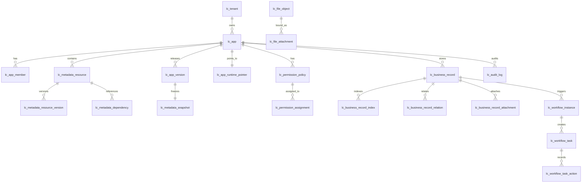

# 30-core-database-design.md

版本：v1.1.1  
适用范围：低代码平台 P0 数据库设计、建表脚本、ORM 实体、数据迁移、索引设计、API 数据访问层、测试用例生成  
最后更新：2026-05-06  
状态：小修订版

---

## 0. v1.1.1 小修订说明

本次修订在 v1.0 基线版基础上完成，不改变 P0 的核心数据库策略：**元数据表 + 通用业务记录表 + JSON 数据字段 + 索引字段扩展**。本次主要补齐后续 API、DDL、ORM、测试用例生成前必须明确的数据库落点和边界。

### 0.1 本次修订重点

```text
1. 新增 lc_user_auth，用于承载 P0 私有化部署下的内置登录认证能力。
2. 新增 lc_sequence_counter，用于合同编号、报销单号、采购申请编号等自动编号。
3. 新增 lc_business_unique_value，用于低代码唯一字段的并发安全控制。
4. 新增 lc_recycle_item，用于应用、元数据、业务记录、文件等统一回收站展示和恢复。
5. 新增 lc_app_template，用于 P0 三个样板应用模板和后续模板创建应用能力。
6. 新增 lc_api_idempotency_key 作为 P0 推荐表，用于表单提交、审批、发布等高风险操作幂等控制。
7. 明确 lc_file_attachment 是文件绑定权威表，lc_business_record_attachment 降级为业务查询冗余表。
8. 明确 lc_app_version 与 lc_metadata_snapshot 的循环引用处理策略。
9. 补充产品状态与数据库状态映射表，避免前端、API、数据库状态语义不一致。
10. 补充软删除唯一索引的跨数据库实现策略。
11. 补充表级交付优先级：P0-Must、P0-Recommended、P0-Optional、P1-Reserved。
```

### 0.2 本次修订不改变的决策

```text
1. P0 仍优先私有化单租户，所有核心表继续预留 tenant_id。
2. P0 仍不为合同、报销、采购等业务对象生成独立物理表。
3. 运行态仍只读取 lc_app_runtime_pointer 指向的 lc_metadata_snapshot。
4. 已发布 app_version 和 metadata_snapshot 仍不可原地修改。
5. 权限校验、字段裁剪、附件下载鉴权仍必须在后端执行。
```

### 0.3 v1.1.1 小修订内容

```text
1. 将表级唯一约束中的“+ is_deleted”统一收口为 UK(active) 语义，避免 DDL 生成歧义。
2. 细化 lc_business_unique_value 的 active 占用唯一约束、释放策略和历史值处理规则。
3. 明确附件下载、预览、删除、恢复和鉴权均以 lc_file_attachment 为权威绑定来源。
4. 澄清发布失败时 app_version / metadata_snapshot 的落库语义。
5. 补充回收站恢复冲突校验。
6. 补充不使用强外键场景下的数据一致性巡检清单。
7. 增加 P0-Must-Core / P0-Must-Support 首批落库优先级，便于研发拆解。
```

## 1. 文档目的

本文档用于定义低代码平台 P0 阶段的核心数据库设计，承接 `20-system-architecture-design.md` 与 `90-metadata-dsl-guideline.md`，将应用中心、组织用户角色、元数据、发布版本、权限、通用业务数据、流程、文件和审计等核心能力落地为统一数据库模型。

本文档不是具体数据库厂商的完整 DDL 脚本。后续可以基于本文生成 PostgreSQL / MySQL 的物理建表 SQL、索引 SQL、迁移脚本与初始化数据。

---

## 2. 前置结论

```text
1. P0 优先私有化单租户，所有核心表预留 tenant_id。
2. 不为每个业务对象生成独立业务表。
3. 元数据统一进入 lc_metadata_resource 及版本/快照相关表。
4. 业务数据统一进入 lc_business_record。
5. 动态字段值存入 data_json。
6. 高频查询、筛选、排序字段进入固定列或 lc_business_record_index。
7. 发布后生成不可变 lc_app_version 与 lc_metadata_snapshot。
8. 运行态只读取 lc_app_runtime_pointer 指向的已发布快照。
9. 流程实例必须绑定启动时的 app_version_id 与 snapshot_id。
10. 权限校验必须在后端执行，数据库设计需支持服务端鉴权和审计。
```

---

## 3. 数据库设计目标

| 目标 | 说明 |
|---|---|
| 元数据统一 | 应用、对象、字段、表单、视图、流程、权限、菜单等 DSL 采用统一资源表存储。 |
| 发布不可变 | 发布版本和快照不可原地修改，保证运行稳定和历史可追溯。 |
| 运行隔离 | 运行态读取已发布快照，不读取设计态草稿。 |
| 通用数据承载 | 所有业务对象数据进入通用记录表，不生成对象专属业务表。 |
| 可检索 | 常用检索字段通过固定列和索引表支持查询，避免完全依赖 JSON 全表扫描。 |
| 可审计 | 配置、数据、流程、权限、附件、发布、回滚等关键变更可追踪。 |
| 可回滚 | 通过运行版本指针回滚，不修改历史快照和历史版本。 |
| 可扩展 | 为 P1/P2 的多租户、复杂流程、BI、外部集成预留扩展字段。 |

---

## 4. 数据库设计原则

```text
1. 表名统一使用 lc_ 前缀。
2. 数据库字段使用 snake_case，API/DSL 使用 camelCase。
3. 核心表使用字符串全局 ID，建议 varchar(64)，可由 UUID v7 或雪花 ID 生成。
4. 所有核心表必须保留 tenant_id。
5. 核心业务表默认软删除，使用 is_deleted + deleted_by + deleted_at。
6. 可编辑表使用 version 做乐观锁。
7. 动态配置和动态字段可以入 JSON，但核心查询必须使用固定列或索引表。
8. 已发布快照不可修改。
```

---

## 5. P0 数据库范围

| 表组 | 表 |
|---|---|
| 租户与应用 | `lc_tenant`, `lc_app_category`, `lc_app`, `lc_app_member` |
| 认证与登录 | `lc_user_auth` |
| 组织用户角色 | `lc_org_unit`, `lc_user`, `lc_role`, `lc_user_org_unit`, `lc_user_role` |
| 元数据与依赖 | `lc_metadata_resource`, `lc_metadata_resource_version`, `lc_metadata_dependency` |
| 发布与运行 | `lc_app_version`, `lc_metadata_snapshot`, `lc_app_runtime_pointer`, `lc_publish_log`, `lc_rollback_log` |
| 权限 | `lc_permission_policy`, `lc_permission_assignment`, `lc_permission_change_log`, `lc_permission_effective_cache` |
| 通用业务数据 | `lc_business_record`, `lc_business_record_index`, `lc_business_record_relation`, `lc_business_record_change_log`, `lc_business_record_attachment`, `lc_business_unique_value` |
| 自动编号与幂等 | `lc_sequence_counter`, `lc_api_idempotency_key` |
| 模板与回收站 | `lc_app_template`, `lc_recycle_item` |
| 流程 | `lc_workflow_runtime_binding`, `lc_workflow_instance`, `lc_workflow_task`, `lc_workflow_task_action`, `lc_workflow_trace` |
| 文件 | `lc_file_object`, `lc_file_attachment`, `lc_file_access_log` |
| 审计与安全 | `lc_audit_log`, `lc_audit_log_detail`, `lc_security_event`, `lc_runtime_error_log` |


### 5.1 表级交付优先级

后续 DDL、ORM、API 和开发任务拆解必须按以下优先级处理。

| 优先级 | 说明 | 表 |
|---|---|---|
| P0-Must | P0 必须建表，核心闭环依赖。 | `lc_tenant`, `lc_user`, `lc_user_auth`, `lc_org_unit`, `lc_role`, `lc_user_org_unit`, `lc_user_role`, `lc_app_category`, `lc_app`, `lc_app_member`, `lc_metadata_resource`, `lc_metadata_resource_version`, `lc_metadata_dependency`, `lc_app_version`, `lc_metadata_snapshot`, `lc_app_runtime_pointer`, `lc_publish_log`, `lc_rollback_log`, `lc_permission_policy`, `lc_permission_assignment`, `lc_permission_change_log`, `lc_business_record`, `lc_business_record_index`, `lc_business_record_relation`, `lc_business_record_change_log`, `lc_workflow_runtime_binding`, `lc_workflow_instance`, `lc_workflow_task`, `lc_workflow_task_action`, `lc_workflow_trace`, `lc_file_object`, `lc_file_attachment`, `lc_audit_log`, `lc_audit_log_detail`, `lc_security_event`, `lc_runtime_error_log`, `lc_sequence_counter`, `lc_business_unique_value`, `lc_recycle_item`, `lc_app_template` |
| P0-Recommended | P0 强烈建议建表，可提升稳定性、可恢复性或幂等性。 | `lc_api_idempotency_key`, `lc_file_access_log` |
| P0-Optional | P0 可用 Redis、日志系统或冗余方式替代，视实现策略决定是否建表。 | `lc_permission_effective_cache`, `lc_business_record_attachment` |
| P1-Reserved | P0 预留能力，不在本次建表范围。 | 插件市场、完整连接器市场、完整 BI、AI 生成历史、RPA/OCR、计费套餐等相关表 |

说明：

```text
1. P0-Must 表必须进入第一版建表脚本。
2. P0-Recommended 表建议进入第一版建表脚本，若不建表必须在技术方案中说明替代机制。
3. P0-Optional 表可以不建表，但 API、服务和测试用例必须知道其是否启用。
4. P1-Reserved 不得被后续 AI 代码生成误判为 P0 必做。
```

### 5.1.1 首批落库优先级

为避免“所有 Must 表等价优先”导致研发拆解困难，P0-Must 内部再按首批落库顺序分为 Core 与 Support。该分级不改变是否进入 P0 的结论，只用于排期、迁移脚本拆分和 API 先后顺序。

| 分级 | 说明 | 代表表 |
|---|---|---|
| P0-Must-Core | 支撑应用创建、登录、组织角色、设计发布、运行态读写、审批和附件鉴权的最小闭环。 | `lc_tenant`, `lc_user`, `lc_user_auth`, `lc_org_unit`, `lc_role`, `lc_app`, `lc_metadata_resource`, `lc_app_version`, `lc_metadata_snapshot`, `lc_app_runtime_pointer`, `lc_business_record`, `lc_business_record_index`, `lc_workflow_instance`, `lc_workflow_task`, `lc_file_object`, `lc_file_attachment`, `lc_audit_log` |
| P0-Must-Support | 支撑样板应用完整体验、恢复、诊断、安全和开发可运营性的配套能力。 | `lc_app_template`, `lc_sequence_counter`, `lc_business_unique_value`, `lc_recycle_item`, `lc_security_event`, `lc_runtime_error_log`, `lc_publish_log`, `lc_rollback_log`, `lc_business_record_change_log`, `lc_workflow_trace` |

约束：

```text
1. P0-Must-Core 应优先进入第一批 DDL、ORM 和 API。
2. P0-Must-Support 仍属于 P0 必做，但可以在核心闭环表之后分批落库。
3. P0-Recommended 和 P0-Optional 不得阻塞核心闭环 API 设计，但必须明确替代方案。
```

### 5.2 P0 表组边界说明

```text
1. lc_file_attachment 是文件绑定关系权威表。
2. lc_business_record_attachment 仅作为业务记录附件查询冗余表，P0 可不建。
3. lc_permission_effective_cache 仅作为数据库级权限缓存方案，若采用 Redis 则可不建。
4. lc_app_template 用于 P0 三个样板模板和从模板创建应用，不做模板市场。
5. lc_api_idempotency_key 用于幂等控制，不涉及分布式事务 Saga。
```

---

## 6. P0 不做范围

```text
1. 不为每个业务对象创建独立物理表。
2. 不设计完整 OLAP / 数仓 / 指标宽表。
3. 不设计复杂多租户计费、套餐、资源配额和租户运营后台表。
4. 不设计插件市场、插件沙箱、第三方组件安装表。
5. 不设计完整 BPMN 运行时全量表。
6. 不设计分布式事务消息表和跨服务 Saga 表。
7. 不设计 AI 自动生成应用的训练、提示词和生成历史表。
8. 不设计原生移动端离线同步表。
```

---

## 7. 总体逻辑数据模型



---

## 8. 推荐物理类型

| 逻辑类型 | PostgreSQL 建议 | MySQL 建议 | 说明 |
|---|---|---|---|
| id | `varchar(64)` 或 `uuid` | `varchar(64)` | 跨库统一建议 `varchar(64)`。 |
| string | `varchar(n)` | `varchar(n)` | 短文本。 |
| text | `text` | `text` | 长文本。 |
| json | `jsonb` | `json` | PostgreSQL 优先 `jsonb`。 |
| datetime | `timestamptz` | `datetime(3)` | 建议统一 UTC 或明确时区策略。 |
| bool | `boolean` | `tinyint(1)` | 由 ORM 映射。 |
| int | `integer` | `int` | 普通整数。 |
| bigint | `bigint` | `bigint` | 文件大小、计数等。 |
| decimal | `numeric(20,6)` | `decimal(20,6)` | 金额或高精度数值。 |

---

## 9. 通用字段规范

核心表建议优先包含：

| 字段 | 类型 | 必填 | 说明 |
| --- | --- | --- | --- |
| id | id | 是 | 主键。 |
| tenant_id | id | 是 | 租户 ID，P0 单租户也必须写入默认租户。 |
| app_id | id | 否 | 应用 ID，平台级表可为空。 |
| status | string(32) | 是 | 业务状态。 |
| version | int | 是 | 乐观锁版本。 |
| created_by | id | 否 | 创建人。 |
| created_at | datetime | 是 | 创建时间。 |
| updated_by | id | 否 | 更新人。 |
| updated_at | datetime | 是 | 更新时间。 |
| deleted_by | id | 否 | 删除人。 |
| deleted_at | datetime | 否 | 删除时间。 |
| is_deleted | bool | 是 | 是否软删除，默认 false。 |
| remark | string(500) | 否 | 备注。 |

说明：

```text
1. 平台级表如 lc_tenant、lc_org_unit、lc_user、lc_role 可不使用 app_id。
2. 日志表可不使用 version 和软删除字段，但必须保留 tenant_id、操作人、时间、request_id / trace_id。
3. 普通查询默认追加 tenant_id 与 is_deleted = false。
```


## 9A. 软删除唯一约束实现策略

v1.0 中大量唯一约束写法包含 `is_deleted`，例如：

```text
UK(old): tenant_id + app_key + is_deleted
```

该写法不得直接生成普通唯一索引；这种写法在“同一编码被删除多次”的场景下可能导致已删除历史记录之间发生唯一冲突。因此 v1.1 明确采用以下策略。

### 9A.1 PostgreSQL 推荐策略

PostgreSQL 优先使用部分唯一索引，只约束未删除记录：

```sql
CREATE UNIQUE INDEX uk_lc_app_tenant_app_key_active
ON lc_app (tenant_id, app_key)
WHERE is_deleted = false;
```

适用于：

```text
lc_app.app_key
lc_app_category.category_key
lc_org_unit.org_key
lc_user.username
lc_role.role_key
lc_metadata_resource.resource_key
lc_permission_policy.policy_key
```

### 9A.2 MySQL 推荐策略

MySQL 不支持同等语义的部分唯一索引时，建议采用以下方案之一：

| 方案 | 说明 | 推荐度 |
|---|---|---|
| active_key 字段 | 未删除时 active_key = 业务编码，删除后 active_key 置空或改写。 | 高 |
| deleted_at 参与唯一索引 | 唯一索引包含 deleted_at，但需处理 NULL 语义。 | 中 |
| 删除时改写业务编码 | 删除时将 app_key 改为 app_key__deleted__{id}。 | 中 |
| 仅应用层校验 | 不建议用于关键编码。 | 低 |

### 9A.3 文档约束

后续生成 DDL 时不得机械生成 `tenant_id + key + is_deleted` 的普通唯一索引。必须根据目标数据库选择部分唯一索引或 active_key 策略。

### 9A.4 文档记法约定

后续各表约束中的 `UK(active)` 表示“未删除记录唯一”，不是一个可以被机械翻译为普通组合唯一索引的字段列表。

```text
1. PostgreSQL：优先生成 WHERE is_deleted = false 的部分唯一索引。
2. MySQL：优先生成 active_key / active_unique_key 一类辅助字段策略，或在删除时改写唯一业务编码。
3. DDL、ORM、迁移脚本和 AI 代码生成均不得把 UK(active) 直接翻译为 tenant_id + key + is_deleted 的普通唯一索引。
4. 若某表无 is_deleted 字段，则不得使用 UK(active) 记法。
```

---

## 10. 状态枚举约定

| 类型 | 状态 |
|---|---|
| 应用状态 | draft, active, inactive, archived, deleted |
| 元数据资源状态 | draft, published, inactive, deleted |
| 发布版本状态 | validating, released, current, rolled_back, disabled, failed |
| 快照状态 | active, inactive, archived |
| 业务记录状态 | draft, submitted, in_approval, approved, rejected, cancelled, voided, deleted |
| 流程实例状态 | running, approved, rejected, withdrawn, voided, terminated, error |
| 流程任务状态 | pending, claimed, approved, rejected, cancelled, expired, transferred |


### 10.1 产品状态与数据库状态映射

为了避免前端、API 与数据库状态不一致，P0 统一使用以下映射。

| 产品展示状态 | lc_app.design_status | lc_app.runtime_status | lc_app.status | is_deleted | 说明 |
|---|---|---|---|---|---|
| 草稿未发布 | draft / changed | unpublished | active | false | 应用存在设计态配置，但尚未发布运行版本。 |
| 已发布运行中 | released | active | active | false | 运行指针指向当前快照，用户可访问运行态。 |
| 有未发布变更 | changed | active | active | false | 已发布版本仍在运行，设计态存在草稿变更。 |
| 已停用 | released / changed | inactive | inactive | false | 应用不可运行，但元数据和业务数据保留。 |
| 已归档 | released | inactive | archived | false | P0 可不开放归档入口，预留。 |
| 已删除/回收站 | 任意 | inactive | deleted | true | 通过回收站恢复前不可运行。 |

### 10.2 资源状态与运行态关系

| 资源类型 | 草稿状态 | 发布后状态 | 停用状态 | 删除状态 | 运行态读取来源 |
|---|---|---|---|---|---|
| metadata resource | draft | published | inactive | deleted | 不直接读取 |
| metadata snapshot | 不适用 | active | inactive | archived | 运行态权威来源 |
| workflow definition | draft | published | inactive | deleted | 快照内 workflow DSL |
| form definition | draft | published | inactive | deleted | 快照内 form DSL |
| permission policy | active / inactive | 快照内固化 | inactive | deleted | 快照内 permission DSL |

说明：

```text
1. 产品态“已发布”不等于数据库 lc_app.status = published。
2. 应用是否可运行由 lc_app.runtime_status 与 lc_app_runtime_pointer 共同决定。
3. 运行态模型以 lc_metadata_snapshot 为准，而不是 metadata_resource.status。
```

---

## 11. lc_tenant：租户表

### 11.1 表职责

保存租户基础信息。P0 私有化单租户也必须初始化默认租户。

### 11.2 字段设计

| 字段 | 类型 | 必填 | 说明 |
| --- | --- | --- | --- |
| id | id | 是 | 租户 ID。 |
| tenant_key | string(64) | 是 | 租户编码，默认 default。 |
| tenant_name | string(200) | 是 | 租户名称。 |
| status | string(32) | 是 | active / inactive。 |
| config_json | json | 否 | 租户级配置预留。 |
| version | int | 是 | 乐观锁版本。 |
| created_by | id | 否 | 创建人。 |
| created_at | datetime | 是 | 创建时间。 |
| updated_by | id | 否 | 更新人。 |
| updated_at | datetime | 是 | 更新时间。 |
| deleted_by | id | 否 | 删除人。 |
| deleted_at | datetime | 否 | 删除时间。 |
| is_deleted | bool | 是 | 是否软删除。 |
| remark | string(500) | 否 | 备注。 |

### 11.3 约束与索引

```text
PK: id
UK: tenant_key
IDX: status + is_deleted
```

### 11.4 关键规则

```text
1. tenant_key 创建后原则上不可修改。
2. P0 可以固定初始化一条 default 租户记录。
```

---

## 12. lc_app_category：应用分类表

### 12.1 表职责

保存应用中心分类，用于应用列表筛选、分组和展示。

### 12.2 字段设计

| 字段 | 类型 | 必填 | 说明 |
| --- | --- | --- | --- |
| id | id | 是 | 分类 ID。 |
| tenant_id | id | 是 | 租户 ID。 |
| category_key | string(64) | 是 | 分类编码。 |
| category_name | string(200) | 是 | 分类名称。 |
| parent_id | id | 否 | 父分类 ID，P0 可为空。 |
| sort_order | int | 是 | 排序号。 |
| status | string(32) | 是 | active / inactive。 |
| version | int | 是 | 乐观锁版本。 |
| created_by | id | 否 | 创建人。 |
| created_at | datetime | 是 | 创建时间。 |
| updated_by | id | 否 | 更新人。 |
| updated_at | datetime | 是 | 更新时间。 |
| deleted_by | id | 否 | 删除人。 |
| deleted_at | datetime | 否 | 删除时间。 |
| is_deleted | bool | 是 | 是否软删除。 |
| remark | string(500) | 否 | 备注。 |

### 12.3 约束与索引

```text
PK: id
UK(active): tenant_id + category_key
IDX: tenant_id + parent_id + sort_order
IDX: tenant_id + status + is_deleted
```

### 12.4 关键规则

```text
1. 分类删除采用软删除。
2. parent_id 预留多级分类能力，P0 可只使用一级分类。
```

---

## 13. lc_app：应用表

### 13.1 表职责

保存低代码应用基础信息和生命周期状态，是元数据、权限、业务数据、流程和审计的主边界。

### 13.2 字段设计

| 字段 | 类型 | 必填 | 说明 |
| --- | --- | --- | --- |
| id | id | 是 | 应用 ID。 |
| tenant_id | id | 是 | 租户 ID。 |
| app_key | string(64) | 是 | 应用编码，租户内唯一。 |
| app_name | string(200) | 是 | 应用名称。 |
| app_desc | string(1000) | 否 | 应用描述。 |
| category_id | id | 否 | 应用分类 ID。 |
| icon | string(200) | 否 | 图标。 |
| owner_id | id | 是 | 应用所有者。 |
| app_type | string(32) | 是 | custom / template_instance / system。 |
| design_status | string(32) | 是 | draft / changed / released。 |
| runtime_status | string(32) | 是 | unpublished / active / inactive。 |
| latest_version_id | id | 否 | 最新发布版本 ID。 |
| current_version_id | id | 否 | 当前运行版本冗余字段，权威以 lc_app_runtime_pointer 为准。 |
| current_snapshot_id | id | 否 | 当前运行快照冗余字段。 |
| settings_json | json | 否 | 应用设置。 |
| status | string(32) | 是 | active / inactive / archived / deleted。 |
| version | int | 是 | 乐观锁版本。 |
| created_by | id | 否 | 创建人。 |
| created_at | datetime | 是 | 创建时间。 |
| updated_by | id | 否 | 更新人。 |
| updated_at | datetime | 是 | 更新时间。 |
| deleted_by | id | 否 | 删除人。 |
| deleted_at | datetime | 否 | 删除时间。 |
| is_deleted | bool | 是 | 是否软删除。 |
| remark | string(500) | 否 | 备注。 |

### 13.3 约束与索引

```text
PK: id
UK(active): tenant_id + app_key
IDX: tenant_id + owner_id + is_deleted
IDX: tenant_id + category_id + status
IDX: tenant_id + runtime_status + is_deleted
```

### 13.4 关键规则

```text
1. app_key 创建后原则上不可修改。
2. 已发布或存在业务数据的应用不得物理删除。
3. current_version_id/current_snapshot_id 仅作展示或查询加速。
```

---

## 14. lc_app_member：应用成员表

### 14.1 表职责

保存用户、角色、部门与应用的成员关系和应用内角色。

### 14.2 字段设计

| 字段 | 类型 | 必填 | 说明 |
| --- | --- | --- | --- |
| id | id | 是 | 成员关系 ID。 |
| tenant_id | id | 是 | 租户 ID。 |
| app_id | id | 是 | 应用 ID。 |
| member_type | string(32) | 是 | user / role / org_unit。 |
| member_id | id | 是 | 成员主体 ID。 |
| app_role | string(64) | 是 | owner / admin / designer / user / reader。 |
| source_type | string(32) | 否 | manual / inherited / template。 |
| effective_from | datetime | 否 | 生效时间。 |
| effective_to | datetime | 否 | 失效时间。 |
| status | string(32) | 是 | active / inactive。 |
| version | int | 是 | 乐观锁版本。 |
| created_by | id | 否 | 创建人。 |
| created_at | datetime | 是 | 创建时间。 |
| updated_by | id | 否 | 更新人。 |
| updated_at | datetime | 是 | 更新时间。 |
| deleted_by | id | 否 | 删除人。 |
| deleted_at | datetime | 否 | 删除时间。 |
| is_deleted | bool | 是 | 是否软删除。 |
| remark | string(500) | 否 | 备注。 |

### 14.3 约束与索引

```text
PK: id
UK(active): tenant_id + app_id + member_type + member_id + app_role
IDX: tenant_id + member_type + member_id + status
IDX: tenant_id + app_id + app_role + status
```

### 14.4 关键规则

```text
1. 应用入口可见性可先基于本表快速判断，再进入权限服务做细粒度校验。
```


## 14A. lc_app_template：应用模板表

### 14A.1 表职责

保存 P0 内置样板应用模板及后续从模板创建应用所需的模板元数据包。P0 不做模板市场，但必须支持合同管理、费用报销、采购申请三个样板模板的初始化和复制创建。

### 14A.2 字段设计

| 字段 | 类型 | 必填 | 说明 |
| --- | --- | --- | --- |
| id | id | 是 | 模板 ID。 |
| tenant_id | id | 是 | 租户 ID。P0 内置模板可使用 default 租户。 |
| template_key | string(128) | 是 | 模板编码，例如 contract_management。 |
| template_name | string(200) | 是 | 模板名称。 |
| template_type | string(32) | 是 | app。P0 仅支持应用模板。 |
| template_version | string(64) | 是 | 模板版本，例如 1.0.0。 |
| source_type | string(32) | 是 | system / imported。P0 默认 system。 |
| category_key | string(64) | 否 | 模板分类。 |
| template_desc | string(1000) | 否 | 模板说明。 |
| template_json | json | 是 | 模板完整元数据包，包含 app、entity、field、form、workflow、permission 等。 |
| preview_json | json | 否 | 模板预览信息，例如图标、截图、对象数量、流程数量。 |
| status | string(32) | 是 | active / inactive / deleted。 |
| version | int | 是 | 乐观锁版本。 |
| created_by | id | 否 | 创建人。 |
| created_at | datetime | 是 | 创建时间。 |
| updated_by | id | 否 | 更新人。 |
| updated_at | datetime | 是 | 更新时间。 |
| deleted_by | id | 否 | 删除人。 |
| deleted_at | datetime | 否 | 删除时间。 |
| is_deleted | bool | 是 | 是否软删除。 |
| remark | string(500) | 否 | 备注。 |

### 14A.3 约束与索引

```text
PK: id
UK(active): tenant_id + template_key + template_version
IDX: tenant_id + template_type + status
IDX: tenant_id + category_key + status
```

### 14A.4 关键规则

```text
1. P0 从模板创建应用时，读取 template_json 并生成新的 app、metadata_resource、permission_policy 等记录。
2. 创建出的应用必须重新生成 app_id、resource_id、policy_id，不能复用模板 ID。
3. P0 不做模板市场、上架审核、计费、评分、下载统计等能力。
4. 模板表保存的是可复制的元数据包，不作为运行态来源。
```

---

## 15. lc_org_unit：组织单元表

### 15.1 表职责

保存企业组织树，支撑部门、负责人、上下级与部门数据权限。

### 15.2 字段设计

| 字段 | 类型 | 必填 | 说明 |
| --- | --- | --- | --- |
| id | id | 是 | 组织单元 ID。 |
| tenant_id | id | 是 | 租户 ID。 |
| org_key | string(64) | 是 | 部门编码。 |
| org_name | string(200) | 是 | 部门名称。 |
| parent_id | id | 否 | 父部门 ID。 |
| org_path | string(1000) | 是 | 层级路径，例如 /root/sales/east。 |
| org_level | int | 是 | 层级深度。 |
| manager_user_id | id | 否 | 部门负责人。 |
| sort_order | int | 是 | 排序号。 |
| status | string(32) | 是 | active / inactive。 |
| version | int | 是 | 乐观锁版本。 |
| created_by | id | 否 | 创建人。 |
| created_at | datetime | 是 | 创建时间。 |
| updated_by | id | 否 | 更新人。 |
| updated_at | datetime | 是 | 更新时间。 |
| deleted_by | id | 否 | 删除人。 |
| deleted_at | datetime | 否 | 删除时间。 |
| is_deleted | bool | 是 | 是否软删除。 |
| remark | string(500) | 否 | 备注。 |

### 15.3 约束与索引

```text
PK: id
UK(active): tenant_id + org_key
IDX: tenant_id + parent_id + sort_order
IDX: tenant_id + org_path
IDX: tenant_id + manager_user_id
```

### 15.4 关键规则

```text
1. org_path 用于快速计算本部门及下级部门范围。
2. 禁止形成组织树环。
3. 停用部门不影响历史记录的 created_dept_id。
```

---

## 16. lc_user：用户表

### 16.1 表职责

保存平台用户信息，是操作、审批、权限、审计和业务归属的核心主体。

### 16.2 字段设计

| 字段 | 类型 | 必填 | 说明 |
| --- | --- | --- | --- |
| id | id | 是 | 用户 ID。 |
| tenant_id | id | 是 | 租户 ID。 |
| username | string(100) | 是 | 登录名。 |
| display_name | string(200) | 是 | 显示名称。 |
| mobile | string(50) | 否 | 手机号。 |
| email | string(200) | 否 | 邮箱。 |
| avatar_file_id | id | 否 | 头像文件 ID。 |
| primary_org_id | id | 否 | 主部门 ID。 |
| direct_manager_id | id | 否 | 直属上级用户 ID。 |
| user_type | string(32) | 是 | internal / external / system。 |
| login_enabled | bool | 是 | 是否允许登录。 |
| profile_json | json | 否 | 扩展信息。 |
| status | string(32) | 是 | active / inactive / locked。 |
| version | int | 是 | 乐观锁版本。 |
| created_by | id | 否 | 创建人。 |
| created_at | datetime | 是 | 创建时间。 |
| updated_by | id | 否 | 更新人。 |
| updated_at | datetime | 是 | 更新时间。 |
| deleted_by | id | 否 | 删除人。 |
| deleted_at | datetime | 否 | 删除时间。 |
| is_deleted | bool | 是 | 是否软删除。 |
| remark | string(500) | 否 | 备注。 |

### 16.3 约束与索引

```text
PK: id
UK(active): tenant_id + username
IDX: tenant_id + email
IDX: tenant_id + mobile
IDX: tenant_id + primary_org_id
IDX: tenant_id + direct_manager_id
```

### 16.4 关键规则

```text
1. 用户停用后不得登录，但历史记录、流程任务和审计仍保留用户 ID。
2. 直属上级用于流程处理人规则。
```


## 16A. lc_user_auth：用户认证表

### 16A.1 表职责

保存用户登录认证凭证和外部身份映射。P0 私有化部署至少需要支持账号密码登录；SSO、OIDC、SAML、企业微信、钉钉、飞书等外部身份源仅预留字段，不作为 P0 必做集成。

### 16A.2 字段设计

| 字段 | 类型 | 必填 | 说明 |
| --- | --- | --- | --- |
| id | id | 是 | 认证记录 ID。 |
| tenant_id | id | 是 | 租户 ID。 |
| user_id | id | 是 | 用户 ID。 |
| auth_type | string(32) | 是 | password / sso / api_token / external。P0 必做 password。 |
| login_identifier | string(200) | 是 | 登录标识，例如用户名、手机号、邮箱或外部账号。 |
| password_hash | string(500) | 否 | 密码哈希，仅 password 类型使用。 |
| password_salt | string(200) | 否 | 密码盐，视加密方案决定是否使用。 |
| external_provider | string(64) | 否 | 外部身份源编码，P1/P2 使用。 |
| external_user_id | string(200) | 否 | 外部身份源用户 ID，P1/P2 使用。 |
| last_login_at | datetime | 否 | 最近登录时间。 |
| last_login_ip | string(64) | 否 | 最近登录 IP。 |
| password_updated_at | datetime | 否 | 密码更新时间。 |
| failed_login_count | int | 是 | 连续登录失败次数。 |
| locked_until | datetime | 否 | 锁定截止时间。 |
| status | string(32) | 是 | active / inactive / locked。 |
| version | int | 是 | 乐观锁版本。 |
| created_by | id | 否 | 创建人。 |
| created_at | datetime | 是 | 创建时间。 |
| updated_by | id | 否 | 更新人。 |
| updated_at | datetime | 是 | 更新时间。 |
| deleted_by | id | 否 | 删除人。 |
| deleted_at | datetime | 否 | 删除时间。 |
| is_deleted | bool | 是 | 是否软删除。 |
| remark | string(500) | 否 | 备注。 |

### 16A.3 约束与索引

```text
PK: id
UK(active): tenant_id + auth_type + login_identifier
IDX: tenant_id + user_id + auth_type + status
IDX: tenant_id + external_provider + external_user_id
```

### 16A.4 关键规则

```text
1. password_hash 不得保存明文密码。
2. 登录时必须同时校验 lc_user.status、lc_user.login_enabled 与 lc_user_auth.status。
3. 用户停用后，不删除认证记录，但不得登录。
4. P0 若不支持手机号/邮箱登录，也应保留 login_identifier 的唯一约束。
5. 认证失败、账号锁定等事件应写入 lc_security_event 或 lc_audit_log。
```

---

## 17. lc_role：角色表

### 17.1 表职责

保存平台级、租户级和可选应用级角色。

### 17.2 字段设计

| 字段 | 类型 | 必填 | 说明 |
| --- | --- | --- | --- |
| id | id | 是 | 角色 ID。 |
| tenant_id | id | 是 | 租户 ID。 |
| role_key | string(64) | 是 | 角色编码。 |
| role_name | string(200) | 是 | 角色名称。 |
| role_type | string(32) | 是 | system / custom / app。 |
| scope_type | string(32) | 是 | tenant / app。 |
| app_id | id | 否 | 应用级角色所属应用。 |
| permission_summary_json | json | 否 | 权限摘要，仅用于展示。 |
| status | string(32) | 是 | active / inactive。 |
| version | int | 是 | 乐观锁版本。 |
| created_by | id | 否 | 创建人。 |
| created_at | datetime | 是 | 创建时间。 |
| updated_by | id | 否 | 更新人。 |
| updated_at | datetime | 是 | 更新时间。 |
| deleted_by | id | 否 | 删除人。 |
| deleted_at | datetime | 否 | 删除时间。 |
| is_deleted | bool | 是 | 是否软删除。 |
| remark | string(500) | 否 | 备注。 |

### 17.3 约束与索引

```text
PK: id
UK(active): tenant_id + app_id + role_key
IDX: tenant_id + role_type + status
IDX: tenant_id + scope_type + app_id
```

### 17.4 关键规则

```text
1. 应用内 owner/admin/designer/user/reader 也可由 lc_app_member.app_role 承载。
```

---

## 18. lc_user_org_unit：用户部门关系表

### 18.1 表职责

支持用户多部门归属和主部门标记。

### 18.2 字段设计

| 字段 | 类型 | 必填 | 说明 |
| --- | --- | --- | --- |
| id | id | 是 | 关系 ID。 |
| tenant_id | id | 是 | 租户 ID。 |
| user_id | id | 是 | 用户 ID。 |
| org_unit_id | id | 是 | 部门 ID。 |
| is_primary | bool | 是 | 是否主部门。 |
| position_name | string(200) | 否 | 职务名称。 |
| status | string(32) | 是 | active / inactive。 |
| version | int | 是 | 乐观锁版本。 |
| created_by | id | 否 | 创建人。 |
| created_at | datetime | 是 | 创建时间。 |
| updated_by | id | 否 | 更新人。 |
| updated_at | datetime | 是 | 更新时间。 |
| deleted_by | id | 否 | 删除人。 |
| deleted_at | datetime | 否 | 删除时间。 |
| is_deleted | bool | 是 | 是否软删除。 |
| remark | string(500) | 否 | 备注。 |

### 18.3 约束与索引

```text
PK: id
UK(active): tenant_id + user_id + org_unit_id
IDX: tenant_id + org_unit_id + status
IDX: tenant_id + user_id + is_primary
```

### 18.4 关键规则

```text
1. 同一用户建议只允许一个 active 主部门。
```

---

## 19. lc_user_role：用户角色关系表

### 19.1 表职责

保存用户与角色的关系，支持租户级和应用级角色。

### 19.2 字段设计

| 字段 | 类型 | 必填 | 说明 |
| --- | --- | --- | --- |
| id | id | 是 | 关系 ID。 |
| tenant_id | id | 是 | 租户 ID。 |
| user_id | id | 是 | 用户 ID。 |
| role_id | id | 是 | 角色 ID。 |
| app_id | id | 否 | 应用 ID，应用级角色使用。 |
| effective_from | datetime | 否 | 生效时间。 |
| effective_to | datetime | 否 | 失效时间。 |
| status | string(32) | 是 | active / inactive。 |
| version | int | 是 | 乐观锁版本。 |
| created_by | id | 否 | 创建人。 |
| created_at | datetime | 是 | 创建时间。 |
| updated_by | id | 否 | 更新人。 |
| updated_at | datetime | 是 | 更新时间。 |
| deleted_by | id | 否 | 删除人。 |
| deleted_at | datetime | 否 | 删除时间。 |
| is_deleted | bool | 是 | 是否软删除。 |
| remark | string(500) | 否 | 备注。 |

### 19.3 约束与索引

```text
PK: id
UK(active): tenant_id + user_id + role_id + app_id
IDX: tenant_id + user_id + status
IDX: tenant_id + role_id + status
IDX: tenant_id + app_id + role_id
```

### 19.4 关键规则

```text
1. 用户角色变化后必须失效相关权限缓存。
```

---

## 20. lc_metadata_resource：元数据资源表

### 20.1 表职责

统一保存设计态元数据资源，包括 entity、field、form、view、workflowDef、permissionPolicy、menu 等 DSL 草稿。

### 20.2 字段设计

| 字段 | 类型 | 必填 | 说明 |
| --- | --- | --- | --- |
| id | id | 是 | 元数据资源 ID。 |
| tenant_id | id | 是 | 租户 ID。 |
| app_id | id | 是 | 应用 ID。 |
| resource_type | string(64) | 是 | 资源类型。 |
| resource_key | string(128) | 是 | 资源编码。 |
| resource_name | string(200) | 是 | 资源名称。 |
| parent_resource_id | id | 否 | 父资源 ID，例如字段所属对象。 |
| parent_resource_key | string(128) | 否 | 父资源编码。 |
| schema_version | string(32) | 是 | DSL Schema 版本。 |
| draft_version | int | 是 | 草稿版本号。 |
| published_version | int | 否 | 最近发布版本号。 |
| draft_json | json | 是 | 设计态草稿 DSL。 |
| latest_published_json | json | 否 | 最近发布 DSL 冗余，运行态不依赖。 |
| checksum | string(128) | 否 | 草稿内容哈希。 |
| status | string(32) | 是 | draft / published / inactive / deleted。 |
| version | int | 是 | 乐观锁版本。 |
| created_by | id | 否 | 创建人。 |
| created_at | datetime | 是 | 创建时间。 |
| updated_by | id | 否 | 更新人。 |
| updated_at | datetime | 是 | 更新时间。 |
| deleted_by | id | 否 | 删除人。 |
| deleted_at | datetime | 否 | 删除时间。 |
| is_deleted | bool | 是 | 是否软删除。 |
| remark | string(500) | 否 | 备注。 |

### 20.3 约束与索引

```text
PK: id
UK(active): tenant_id + app_id + resource_type + resource_key
IDX: tenant_id + app_id + resource_type + status
IDX: tenant_id + app_id + parent_resource_id
IDX: tenant_id + app_id + updated_at
```

### 20.4 关键规则

```text
1. 设计态保存只更新 draft_json，不影响运行态。
2. 运行态权威数据来自 lc_metadata_snapshot.snapshot_json。
3. resource_key 创建后原则上不可修改。
```

---

## 21. lc_metadata_resource_version：元数据资源版本表

### 21.1 表职责

保存元数据资源的发布级版本或关键草稿历史，支持对比、回溯和快照构建。

### 21.2 字段设计

| 字段 | 类型 | 必填 | 说明 |
| --- | --- | --- | --- |
| id | id | 是 | 版本 ID。 |
| tenant_id | id | 是 | 租户 ID。 |
| app_id | id | 是 | 应用 ID。 |
| resource_id | id | 是 | 资源 ID。 |
| resource_type | string(64) | 是 | 资源类型。 |
| resource_key | string(128) | 是 | 资源编码。 |
| resource_name | string(200) | 是 | 资源名称。 |
| schema_version | string(32) | 是 | DSL Schema 版本。 |
| resource_version | int | 是 | 资源版本号。 |
| app_version_id | id | 否 | 所属应用发布版本。 |
| snapshot_id | id | 否 | 所属元数据快照 ID。 |
| version_type | string(32) | 是 | draft / release / import。 |
| metadata_json | json | 是 | 该版本资源 DSL。 |
| metadata_hash | string(128) | 是 | 内容哈希。 |
| change_summary | string(1000) | 否 | 变更摘要。 |
| status | string(32) | 是 | active / archived。 |
| created_by | id | 否 | 创建人。 |
| created_at | datetime | 是 | 创建时间。 |

### 21.3 约束与索引

```text
PK: id
UK: tenant_id + app_id + resource_id + resource_version + version_type
IDX: tenant_id + app_id + app_version_id
IDX: tenant_id + app_id + snapshot_id
IDX: tenant_id + app_id + resource_type + resource_key
```

### 21.4 关键规则

```text
1. 发布版本创建后不可修改。
2. 同一 app_version_id 下同一 resource_key 只能出现一个发布资源版本。
```

---

## 22. lc_metadata_dependency：元数据依赖关系表

### 22.1 表职责

保存资源之间引用关系，用于发布校验、影响分析、删除保护和导入导出依赖排序。

### 22.2 字段设计

| 字段 | 类型 | 必填 | 说明 |
| --- | --- | --- | --- |
| id | id | 是 | 依赖 ID。 |
| tenant_id | id | 是 | 租户 ID。 |
| app_id | id | 是 | 应用 ID。 |
| source_resource_id | id | 是 | 源资源 ID。 |
| source_resource_type | string(64) | 是 | 源资源类型。 |
| source_resource_key | string(128) | 是 | 源资源编码。 |
| target_resource_id | id | 否 | 目标资源 ID。 |
| target_resource_type | string(64) | 是 | 目标资源类型。 |
| target_resource_key | string(128) | 是 | 目标资源编码。 |
| dependency_type | string(64) | 是 | bind / reference / condition / permission / workflow / menu。 |
| dependency_path | string(500) | 否 | DSL 内引用路径。 |
| required | bool | 是 | 是否强依赖。 |
| status | string(32) | 是 | active / broken / deleted。 |
| version | int | 是 | 乐观锁版本。 |
| created_by | id | 否 | 创建人。 |
| created_at | datetime | 是 | 创建时间。 |
| updated_by | id | 否 | 更新人。 |
| updated_at | datetime | 是 | 更新时间。 |
| deleted_by | id | 否 | 删除人。 |
| deleted_at | datetime | 否 | 删除时间。 |
| is_deleted | bool | 是 | 是否软删除。 |
| remark | string(500) | 否 | 备注。 |

### 22.3 约束与索引

```text
PK: id
IDX: tenant_id + app_id + source_resource_id
IDX: tenant_id + app_id + target_resource_id
IDX: tenant_id + app_id + target_resource_type + target_resource_key
IDX: tenant_id + app_id + dependency_type + status
```

### 22.4 关键规则

```text
1. 发布前必须检查 required = true 的依赖完整。
2. 删除字段、对象、表单、流程前必须查询 target 侧依赖。
```

---

## 23. lc_app_version：应用发布版本表

### 23.1 表职责

保存每次发布形成的不可变应用版本。

### 23.2 字段设计

| 字段 | 类型 | 必填 | 说明 |
| --- | --- | --- | --- |
| id | id | 是 | 应用版本 ID。 |
| tenant_id | id | 是 | 租户 ID。 |
| app_id | id | 是 | 应用 ID。 |
| version_no | string(64) | 是 | 版本号。 |
| version_name | string(200) | 否 | 版本名称。 |
| release_note | string(2000) | 否 | 发布说明。 |
| metadata_snapshot_id | id | 是 | 元数据快照 ID。 |
| previous_version_id | id | 否 | 上一版本 ID。 |
| rollback_from_version_id | id | 否 | 若由回滚产生，记录来源版本。 |
| release_status | string(32) | 是 | validating / released / current / rolled_back / disabled / failed。 |
| is_current | bool | 是 | 是否当前运行版本，冗余字段。 |
| released_by | id | 是 | 发布人。 |
| released_at | datetime | 是 | 发布时间。 |
| validation_result_json | json | 否 | 发布校验结果摘要。 |
| metadata_hash | string(128) | 是 | 快照哈希冗余。 |
| status | string(32) | 是 | active / inactive / archived。 |
| created_by | id | 否 | 创建人。 |
| created_at | datetime | 是 | 创建时间。 |
| updated_by | id | 否 | 更新人。 |
| updated_at | datetime | 是 | 更新时间。 |
| remark | string(500) | 否 | 备注。 |

### 23.3 约束与索引

```text
PK: id
UK: tenant_id + app_id + version_no
UK: tenant_id + app_id + metadata_snapshot_id
IDX: tenant_id + app_id + released_at
IDX: tenant_id + app_id + is_current
IDX: tenant_id + app_id + release_status
```

### 23.4 关键规则

```text
1. 发布成功后核心内容不得原地修改。
2. current 语义以 lc_app_runtime_pointer 为准。
3. 发布失败通常只写 lc_publish_log failed，不生成可运行 app_version。
4. 若实现上需要保留 failed app_version，则该版本不得关联 active snapshot，不得被 lc_app_runtime_pointer 引用，也不得作为回滚目标。
5. failed 版本如落库，仅用于排障、审计或发布重试上下文，不属于运行态版本集合。
```

---

## 24. lc_metadata_snapshot：元数据快照表

### 24.1 表职责

保存应用发布时生成的完整运行态元数据快照。

### 24.2 字段设计

| 字段 | 类型 | 必填 | 说明 |
| --- | --- | --- | --- |
| id | id | 是 | 快照 ID。 |
| tenant_id | id | 是 | 租户 ID。 |
| app_id | id | 是 | 应用 ID。 |
| app_version_id | id | 是 | 应用版本 ID。 |
| schema_version | string(32) | 是 | 快照 Schema 版本。 |
| snapshot_json | json | 是 | 完整快照 JSON。 |
| snapshot_hash | string(128) | 是 | 快照哈希。 |
| snapshot_size | bigint | 否 | 快照大小。 |
| resource_count | int | 否 | 快照内资源数量。 |
| build_result_json | json | 否 | 快照构建摘要。 |
| status | string(32) | 是 | active / inactive / archived。 |
| created_by | id | 是 | 创建人。 |
| created_at | datetime | 是 | 创建时间。 |

### 24.3 约束与索引

```text
PK: id
UK: tenant_id + app_id + app_version_id
IDX: tenant_id + app_id + snapshot_hash
IDX: tenant_id + app_id + created_at
```

### 24.4 关键规则

```text
1. snapshot_json 创建后不可修改。
2. 运行态不得从 lc_metadata_resource 读取草稿。
```


## 24A. app_version 与 metadata_snapshot 循环引用处理策略

### 24A.1 问题说明

`lc_app_version.metadata_snapshot_id` 与 `lc_metadata_snapshot.app_version_id` 在逻辑上互相引用。如果后续 DDL 或 ORM 强制使用数据库外键，可能产生插入顺序问题。

### 24A.2 P0 推荐策略

P0 采用“预生成 ID + 同一事务插入”的策略：

```text
1. 发布开始时先生成 appVersionId 和 snapshotId。
2. 构建 snapshot_json。
3. 插入 lc_metadata_snapshot，写入 app_version_id = appVersionId。
4. 插入 lc_app_version，写入 metadata_snapshot_id = snapshotId。
5. 插入或更新 lc_app_runtime_pointer。
6. 提交事务。
```

### 24A.3 外键策略

```text
1. P0 不强制数据库外键，因此应用层保证两者一致。
2. 若未来引入数据库外键，PostgreSQL 可考虑 DEFERRABLE 约束。
3. MySQL 场景如强制外键，需允许其中一个字段后置更新或调整为单向外键。
```

### 24A.4 约束

```text
1. appVersionId 与 snapshotId 一旦进入发布事务，不得复用给其他发布。
2. 发布失败时，两者相关记录必须回滚或标记 failed，不得被运行指针引用。
3. 运行态以 lc_app_runtime_pointer.current_snapshot_id 为准。
```

---

## 25. lc_app_runtime_pointer：应用运行版本指针表

### 25.1 表职责

保存应用当前运行版本和快照指针，发布、回滚和停用时更新。

### 25.2 字段设计

| 字段 | 类型 | 必填 | 说明 |
| --- | --- | --- | --- |
| id | id | 是 | 指针 ID。 |
| tenant_id | id | 是 | 租户 ID。 |
| app_id | id | 是 | 应用 ID。 |
| current_version_id | id | 是 | 当前运行版本 ID。 |
| current_snapshot_id | id | 是 | 当前运行快照 ID。 |
| previous_version_id | id | 否 | 上一个运行版本 ID。 |
| previous_snapshot_id | id | 否 | 上一个运行快照 ID。 |
| pointer_status | string(32) | 是 | active / inactive / broken。 |
| switched_by | id | 是 | 最近切换人。 |
| switched_at | datetime | 是 | 最近切换时间。 |
| switch_reason | string(500) | 否 | 切换原因。 |
| status | string(32) | 是 | active / inactive。 |
| version | int | 是 | 乐观锁版本。 |
| created_by | id | 否 | 创建人。 |
| created_at | datetime | 是 | 创建时间。 |
| updated_by | id | 否 | 更新人。 |
| updated_at | datetime | 是 | 更新时间。 |
| remark | string(500) | 否 | 备注。 |

### 25.3 约束与索引

```text
PK: id
UK: tenant_id + app_id
IDX: tenant_id + app_id + current_version_id
IDX: tenant_id + app_id + current_snapshot_id
IDX: tenant_id + pointer_status
```

### 25.4 关键规则

```text
1. 发布成功或回滚成功的最后一步才切换 pointer。
2. pointer 更新后必须失效运行态元数据缓存和权限缓存。
```

---

## 26. lc_publish_log：发布日志表

### 26.1 表职责

记录发布校验、发布执行、发布失败、启停应用等操作。

### 26.2 字段设计

| 字段 | 类型 | 必填 | 说明 |
| --- | --- | --- | --- |
| id | id | 是 | 日志 ID。 |
| tenant_id | id | 是 | 租户 ID。 |
| app_id | id | 是 | 应用 ID。 |
| app_version_id | id | 否 | 应用版本 ID。 |
| snapshot_id | id | 否 | 快照 ID。 |
| operation_type | string(64) | 是 | validate / release / disable / enable。 |
| operation_status | string(32) | 是 | success / failed / running。 |
| operator_id | id | 是 | 操作人。 |
| operation_time | datetime | 是 | 操作时间。 |
| release_note | string(2000) | 否 | 发布说明。 |
| validation_result_json | json | 否 | 校验结果。 |
| error_code | string(64) | 否 | 错误码。 |
| error_message | string(2000) | 否 | 错误信息。 |
| request_id | string(128) | 否 | 请求 ID。 |
| trace_id | string(128) | 否 | 链路 ID。 |
| client_ip | string(64) | 否 | 客户端 IP。 |
| user_agent | string(500) | 否 | User-Agent。 |
| created_at | datetime | 是 | 创建时间。 |

### 26.3 约束与索引

```text
PK: id
IDX: tenant_id + app_id + operation_time
IDX: tenant_id + app_id + operation_type + operation_status
IDX: tenant_id + app_version_id
IDX: tenant_id + request_id
```

### 26.4 关键规则

```text
1. 发布失败必须记录 failed 日志，且不得切换运行指针。
```

---

## 27. lc_rollback_log：回滚日志表

### 27.1 表职责

记录应用从当前版本回滚到历史版本的操作过程和结果。

### 27.2 字段设计

| 字段 | 类型 | 必填 | 说明 |
| --- | --- | --- | --- |
| id | id | 是 | 回滚日志 ID。 |
| tenant_id | id | 是 | 租户 ID。 |
| app_id | id | 是 | 应用 ID。 |
| from_version_id | id | 是 | 回滚前版本 ID。 |
| from_snapshot_id | id | 是 | 回滚前快照 ID。 |
| to_version_id | id | 是 | 回滚目标版本 ID。 |
| to_snapshot_id | id | 是 | 回滚目标快照 ID。 |
| rollback_reason | string(1000) | 否 | 回滚原因。 |
| operation_status | string(32) | 是 | success / failed / running。 |
| operator_id | id | 是 | 操作人。 |
| operation_time | datetime | 是 | 操作时间。 |
| validation_result_json | json | 否 | 校验结果。 |
| error_code | string(64) | 否 | 错误码。 |
| error_message | string(2000) | 否 | 错误信息。 |
| request_id | string(128) | 否 | 请求 ID。 |
| trace_id | string(128) | 否 | 链路 ID。 |
| created_at | datetime | 是 | 创建时间。 |

### 27.3 约束与索引

```text
PK: id
IDX: tenant_id + app_id + operation_time
IDX: tenant_id + app_id + from_version_id
IDX: tenant_id + app_id + to_version_id
IDX: tenant_id + request_id
```

### 27.4 关键规则

```text
1. 回滚只切换运行指针，不修改历史 app_version 和 metadata_snapshot。
```

---

## 28. lc_permission_policy：权限策略表

### 28.1 表职责

保存权限策略 DSL，覆盖应用、菜单、对象、数据、字段、流程和流程节点字段权限。

### 28.2 字段设计

| 字段 | 类型 | 必填 | 说明 |
| --- | --- | --- | --- |
| id | id | 是 | 权限策略 ID。 |
| tenant_id | id | 是 | 租户 ID。 |
| app_id | id | 是 | 应用 ID。 |
| policy_key | string(128) | 是 | 策略编码。 |
| policy_name | string(200) | 是 | 策略名称。 |
| policy_type | string(64) | 是 | app / menu / object / data / field / workflow / node_field。 |
| target_type | string(64) | 是 | app / menu / entity / field / workflow / workflow_node。 |
| target_resource_id | id | 否 | 目标资源 ID。 |
| target_resource_key | string(128) | 否 | 目标资源编码。 |
| effect | string(16) | 是 | allow / deny。 |
| priority | int | 是 | 优先级，数字越小越优先。 |
| policy_json | json | 是 | 权限策略 DSL。 |
| schema_version | string(32) | 是 | 策略 DSL 版本。 |
| status | string(32) | 是 | active / inactive / deleted。 |
| version | int | 是 | 乐观锁版本。 |
| created_by | id | 否 | 创建人。 |
| created_at | datetime | 是 | 创建时间。 |
| updated_by | id | 否 | 更新人。 |
| updated_at | datetime | 是 | 更新时间。 |
| deleted_by | id | 否 | 删除人。 |
| deleted_at | datetime | 否 | 删除时间。 |
| is_deleted | bool | 是 | 是否软删除。 |
| remark | string(500) | 否 | 备注。 |

### 28.3 约束与索引

```text
PK: id
UK(active): tenant_id + app_id + policy_key
IDX: tenant_id + app_id + policy_type + status
IDX: tenant_id + app_id + target_type + target_resource_key
IDX: tenant_id + app_id + effect + priority
```

### 28.4 关键规则

```text
1. 运行态权限以快照内权限模型为准；本表用于设计态、管理态和缓存构建。
2. deny 优先于 allow。
```

---

## 29. lc_permission_assignment：权限分配表

### 29.1 表职责

保存权限策略分配给用户、角色、部门、应用角色等主体的关系。

### 29.2 字段设计

| 字段 | 类型 | 必填 | 说明 |
| --- | --- | --- | --- |
| id | id | 是 | 分配 ID。 |
| tenant_id | id | 是 | 租户 ID。 |
| app_id | id | 是 | 应用 ID。 |
| policy_id | id | 是 | 权限策略 ID。 |
| subject_type | string(32) | 是 | user / role / org_unit / app_role / workflow_actor。 |
| subject_id | id | 否 | 主体 ID。 |
| subject_key | string(128) | 否 | 主体编码，例如 app_role=admin。 |
| effective_from | datetime | 否 | 生效时间。 |
| effective_to | datetime | 否 | 失效时间。 |
| status | string(32) | 是 | active / inactive。 |
| version | int | 是 | 乐观锁版本。 |
| created_by | id | 否 | 创建人。 |
| created_at | datetime | 是 | 创建时间。 |
| updated_by | id | 否 | 更新人。 |
| updated_at | datetime | 是 | 更新时间。 |
| deleted_by | id | 否 | 删除人。 |
| deleted_at | datetime | 否 | 删除时间。 |
| is_deleted | bool | 是 | 是否软删除。 |
| remark | string(500) | 否 | 备注。 |

### 29.3 约束与索引

```text
PK: id
UK(active): tenant_id + app_id + policy_id + subject_type + subject_id + subject_key
IDX: tenant_id + app_id + subject_type + subject_id + status
IDX: tenant_id + app_id + policy_id + status
```

### 29.4 关键规则

```text
1. 权限分配变更必须写入权限变更日志并失效相关缓存。
```

---

## 30. lc_permission_change_log：权限变更日志表

### 30.1 表职责

记录权限策略和权限分配的变更历史。

### 30.2 字段设计

| 字段 | 类型 | 必填 | 说明 |
| --- | --- | --- | --- |
| id | id | 是 | 日志 ID。 |
| tenant_id | id | 是 | 租户 ID。 |
| app_id | id | 是 | 应用 ID。 |
| policy_id | id | 否 | 策略 ID。 |
| assignment_id | id | 否 | 分配 ID。 |
| change_type | string(64) | 是 | create / update / delete / enable / disable。 |
| before_json | json | 否 | 变更前内容。 |
| after_json | json | 否 | 变更后内容。 |
| diff_json | json | 否 | 差异。 |
| operator_id | id | 是 | 操作人。 |
| operation_time | datetime | 是 | 操作时间。 |
| request_id | string(128) | 否 | 请求 ID。 |
| trace_id | string(128) | 否 | 链路 ID。 |
| created_at | datetime | 是 | 创建时间。 |

### 30.3 约束与索引

```text
PK: id
IDX: tenant_id + app_id + operation_time
IDX: tenant_id + app_id + policy_id
IDX: tenant_id + operator_id + operation_time
```

### 30.4 关键规则

```text
1. 权限变更属于高风险审计事件。
```

---

## 31. lc_permission_effective_cache：权限有效缓存表（P0-Optional）

### 31.1 表职责

缓存发布后或运行态计算后的有效权限结果，P0 可用 Redis 替代。若采用 Redis，本表不进入 P0-Must 建表范围。

### 31.2 字段设计

| 字段 | 类型 | 必填 | 说明 |
| --- | --- | --- | --- |
| id | id | 是 | 缓存 ID。 |
| tenant_id | id | 是 | 租户 ID。 |
| app_id | id | 是 | 应用 ID。 |
| snapshot_id | id | 是 | 快照 ID。 |
| user_id | id | 是 | 用户 ID。 |
| entity_key | string(128) | 否 | 对象编码。 |
| cache_key | string(500) | 是 | 缓存 Key。 |
| permission_json | json | 是 | 有效权限结果。 |
| permission_hash | string(128) | 是 | 权限结果哈希。 |
| expires_at | datetime | 否 | 过期时间。 |
| status | string(32) | 是 | active / expired。 |
| created_at | datetime | 是 | 创建时间。 |
| updated_at | datetime | 是 | 更新时间。 |

### 31.3 约束与索引

```text
PK: id
UK: tenant_id + app_id + snapshot_id + user_id + cache_key
IDX: tenant_id + app_id + snapshot_id + user_id
IDX: tenant_id + expires_at
```

### 31.4 关键规则

```text
1. 发布、回滚、用户角色变更、应用成员变更、权限策略变更后必须失效缓存。
```

---

## 32. lc_business_record：通用业务记录表

### 32.1 表职责

保存所有低代码业务对象运行态业务记录，不为合同、报销、采购等对象单独建表。

### 32.2 字段设计

| 字段 | 类型 | 必填 | 说明 |
| --- | --- | --- | --- |
| id | id | 是 | 业务记录 ID。 |
| tenant_id | id | 是 | 租户 ID。 |
| app_id | id | 是 | 应用 ID。 |
| entity_id | id | 否 | 对象资源 ID。 |
| entity_key | string(128) | 是 | 对象编码。 |
| record_no | string(128) | 否 | 业务编号。 |
| record_title | string(500) | 否 | 主字段展示值。 |
| business_status | string(64) | 是 | 业务状态。 |
| workflow_status | string(64) | 否 | 流程状态。 |
| app_version_id | id | 是 | 创建或最近提交时应用版本 ID。 |
| snapshot_id | id | 是 | 创建或最近提交时快照 ID。 |
| data_json | json | 是 | 完整业务数据 JSON。 |
| search_text | string(2000) | 否 | 搜索文本冗余。 |
| created_dept_id | id | 否 | 创建人主部门 ID。 |
| owner_user_id | id | 否 | 记录负责人。 |
| owner_dept_id | id | 否 | 负责人部门。 |
| submitted_by | id | 否 | 提交人。 |
| submitted_at | datetime | 否 | 提交时间。 |
| approved_at | datetime | 否 | 通过时间。 |
| voided_by | id | 否 | 作废人。 |
| voided_at | datetime | 否 | 作废时间。 |
| status | string(32) | 是 | active / inactive / deleted。 |
| version | int | 是 | 乐观锁版本。 |
| created_by | id | 否 | 创建人。 |
| created_at | datetime | 是 | 创建时间。 |
| updated_by | id | 否 | 更新人。 |
| updated_at | datetime | 是 | 更新时间。 |
| deleted_by | id | 否 | 删除人。 |
| deleted_at | datetime | 否 | 删除时间。 |
| is_deleted | bool | 是 | 是否软删除。 |
| remark | string(500) | 否 | 备注。 |

### 32.3 约束与索引

```text
PK: id
UK(active): tenant_id + app_id + entity_key + record_no（record_no 存在时）
IDX: tenant_id + app_id + entity_key + business_status + is_deleted
IDX: tenant_id + app_id + entity_key + created_by + created_at
IDX: tenant_id + app_id + entity_key + created_dept_id + created_at
IDX: tenant_id + app_version_id
IDX: tenant_id + snapshot_id
```

### 32.4 关键规则

```text
1. data_json 只能保存已发布快照允许的字段。
2. 提交时必须过滤用户无权编辑字段。
3. 读取时必须过滤用户无权查看字段。
4. 业务记录必须绑定 app_version_id 和 snapshot_id。
5. P0 子表默认存入主记录 data_json。
```

---

## 33. lc_business_record_index：业务记录索引表

### 33.1 表职责

保存可检索、可排序、可参与数据权限判断的字段值，避免 JSON 全表扫描。

### 33.2 字段设计

| 字段 | 类型 | 必填 | 说明 |
| --- | --- | --- | --- |
| id | id | 是 | 索引记录 ID。 |
| tenant_id | id | 是 | 租户 ID。 |
| app_id | id | 是 | 应用 ID。 |
| entity_key | string(128) | 是 | 对象编码。 |
| record_id | id | 是 | 业务记录 ID。 |
| field_key | string(128) | 是 | 字段编码。 |
| field_type | string(64) | 是 | 字段类型。 |
| string_value | string(1000) | 否 | 文本、枚举、人员、部门等。 |
| number_value | decimal | 否 | 数字、金额。 |
| datetime_value | datetime | 否 | 日期时间。 |
| bool_value | bool | 否 | 布尔值。 |
| array_value_json | json | 否 | 多选、多人、多部门数组值。 |
| normalized_value | string(1000) | 否 | 标准化检索值。 |
| status | string(32) | 是 | active / deleted。 |
| created_at | datetime | 是 | 创建时间。 |
| updated_at | datetime | 是 | 更新时间。 |

### 33.3 约束与索引

```text
PK: id
UK: tenant_id + app_id + entity_key + record_id + field_key
IDX: tenant_id + app_id + entity_key + field_key + string_value
IDX: tenant_id + app_id + entity_key + field_key + number_value
IDX: tenant_id + app_id + entity_key + field_key + datetime_value
IDX: tenant_id + app_id + entity_key + record_id
```

### 33.4 关键规则

```text
1. 只有 searchable、filterable、sortable 或 permissionRelevant 字段进入索引表。
2. 业务记录保存后，索引表必须在同一事务内同步。
```


## 33A. lc_business_unique_value：业务唯一字段占用表

### 33A.1 表职责

保存低代码对象中声明为唯一的字段值占用关系，用于解决“应用层先查后写”在并发场景下可能产生重复值的问题。

### 33A.2 字段设计

| 字段 | 类型 | 必填 | 说明 |
| --- | --- | --- | --- |
| id | id | 是 | 唯一值占用 ID。 |
| tenant_id | id | 是 | 租户 ID。 |
| app_id | id | 是 | 应用 ID。 |
| entity_key | string(128) | 是 | 对象编码。 |
| field_key | string(128) | 是 | 唯一字段编码。 |
| normalized_value | string(1000) | 是 | 标准化后的字段值。 |
| value_hash | string(128) | 是 | 标准化值哈希，用于唯一约束和缩短索引长度。 |
| record_id | id | 是 | 占用该唯一值的业务记录 ID。 |
| occupy_status | string(32) | 是 | active / released / deleted。active 表示当前占用。 |
| release_policy | string(32) | 否 | never_reuse / reusable_after_delete / reusable_after_void。默认 never_reuse。 |
| version | int | 是 | 乐观锁版本。 |
| created_by | id | 否 | 创建人。 |
| created_at | datetime | 是 | 创建时间。 |
| updated_by | id | 否 | 更新人。 |
| updated_at | datetime | 是 | 更新时间。 |
| deleted_by | id | 否 | 删除人。 |
| deleted_at | datetime | 否 | 删除时间。 |
| is_deleted | bool | 是 | 是否软删除。 |
| remark | string(500) | 否 | 备注。 |

### 33A.3 约束与索引

```text
PK: id
UK(occupy_active): tenant_id + app_id + entity_key + field_key + value_hash
IDX: tenant_id + app_id + entity_key + record_id
IDX: tenant_id + app_id + entity_key + field_key + occupy_status
```

说明：`UK(occupy_active)` 表示仅 `occupy_status = active` 的占用记录参与唯一约束。PostgreSQL 可用部分唯一索引实现，MySQL 可用 active_value_hash / active_hash 辅助字段实现。

### 33A.4 关键规则

```text
1. 声明 unique = true 的字段必须在保存业务记录时同步写入本表。
2. 新增记录时先尝试插入 occupy_status = active 的唯一值占用，冲突即返回唯一校验失败。
3. 更新唯一字段时必须释放旧 active 值并占用新 active 值，建议在同一事务内完成。
4. 默认 release_policy = never_reuse，软删除、作废或撤销后仍保留历史占用，避免历史编号或关键编码被复用。
5. 若字段 DSL 明确允许复用，释放旧值时应将 occupy_status 更新为 released，并确保只有 active 记录参与唯一约束。
6. released / deleted / historical 记录不参与 active 唯一占用；如目标数据库无法表达部分唯一索引，需采用 active_hash 或 active_value_hash 辅助字段。
7. 本表与 lc_business_record_index 不互相替代：index 用于查询，unique_value 用于强唯一。
```

---

## 34. lc_business_record_relation：业务记录关系表

### 34.1 表职责

保存业务记录之间的 lookup、父子或引用关系。

### 34.2 字段设计

| 字段 | 类型 | 必填 | 说明 |
| --- | --- | --- | --- |
| id | id | 是 | 关系 ID。 |
| tenant_id | id | 是 | 租户 ID。 |
| app_id | id | 是 | 应用 ID。 |
| source_entity_key | string(128) | 是 | 源对象编码。 |
| source_record_id | id | 是 | 源记录 ID。 |
| source_field_key | string(128) | 否 | 源字段编码。 |
| target_app_id | id | 否 | 目标应用 ID，P0 默认同应用。 |
| target_entity_key | string(128) | 是 | 目标对象编码。 |
| target_record_id | id | 是 | 目标记录 ID。 |
| relation_type | string(64) | 是 | lookup / parent_child / reference。 |
| status | string(32) | 是 | active / deleted。 |
| version | int | 是 | 乐观锁版本。 |
| created_by | id | 否 | 创建人。 |
| created_at | datetime | 是 | 创建时间。 |
| updated_by | id | 否 | 更新人。 |
| updated_at | datetime | 是 | 更新时间。 |
| deleted_by | id | 否 | 删除人。 |
| deleted_at | datetime | 否 | 删除时间。 |
| is_deleted | bool | 是 | 是否软删除。 |
| remark | string(500) | 否 | 备注。 |

### 34.3 约束与索引

```text
PK: id
IDX: tenant_id + app_id + source_entity_key + source_record_id
IDX: tenant_id + target_app_id + target_entity_key + target_record_id
IDX: tenant_id + app_id + relation_type
```

### 34.4 关键规则

```text
1. lookup 字段保存时同步维护关系表。
2. 删除目标记录前需要检查是否被引用。
```

---

## 35. lc_business_record_change_log：业务记录变更日志表

### 35.1 表职责

保存业务记录的数据变更历史，用于审计、追溯和差异对比。

### 35.2 字段设计

| 字段 | 类型 | 必填 | 说明 |
| --- | --- | --- | --- |
| id | id | 是 | 日志 ID。 |
| tenant_id | id | 是 | 租户 ID。 |
| app_id | id | 是 | 应用 ID。 |
| entity_key | string(128) | 是 | 对象编码。 |
| record_id | id | 是 | 业务记录 ID。 |
| app_version_id | id | 否 | 操作时应用版本 ID。 |
| snapshot_id | id | 否 | 操作时快照 ID。 |
| change_type | string(64) | 是 | create / update / submit / approve_update / delete / void。 |
| before_json | json | 否 | 变更前数据。 |
| after_json | json | 否 | 变更后数据。 |
| diff_json | json | 否 | 字段级差异。 |
| changed_fields_json | json | 否 | 变更字段列表。 |
| operator_id | id | 是 | 操作人。 |
| operation_time | datetime | 是 | 操作时间。 |
| request_id | string(128) | 否 | 请求 ID。 |
| trace_id | string(128) | 否 | 链路 ID。 |
| created_at | datetime | 是 | 创建时间。 |

### 35.3 约束与索引

```text
PK: id
IDX: tenant_id + app_id + entity_key + record_id + operation_time
IDX: tenant_id + operator_id + operation_time
IDX: tenant_id + snapshot_id
IDX: tenant_id + trace_id
```

### 35.4 关键规则

```text
1. 敏感字段的 before_json/after_json 可按策略脱敏或只记录 diff 摘要。
```

---

## 36. lc_business_record_attachment：业务记录附件查询冗余表（P0-Optional）

### 36.1 表职责

保存业务记录字段与文件之间的查询冗余关系。v1.1 明确 `lc_file_attachment` 是文件绑定权威表；本表仅用于优化业务记录详情、列表和附件字段查询，P0 可不建。

### 36.2 字段设计

| 字段 | 类型 | 必填 | 说明 |
| --- | --- | --- | --- |
| id | id | 是 | 关系 ID。 |
| tenant_id | id | 是 | 租户 ID。 |
| app_id | id | 是 | 应用 ID。 |
| entity_key | string(128) | 是 | 对象编码。 |
| record_id | id | 是 | 业务记录 ID。 |
| field_key | string(128) | 否 | 附件字段编码。 |
| file_id | id | 是 | 文件 ID。 |
| attachment_type | string(64) | 是 | field / workflow_comment / system。 |
| status | string(32) | 是 | active / deleted。 |
| version | int | 是 | 乐观锁版本。 |
| created_by | id | 否 | 创建人。 |
| created_at | datetime | 是 | 创建时间。 |
| updated_by | id | 否 | 更新人。 |
| updated_at | datetime | 是 | 更新时间。 |
| deleted_by | id | 否 | 删除人。 |
| deleted_at | datetime | 否 | 删除时间。 |
| is_deleted | bool | 是 | 是否软删除。 |
| remark | string(500) | 否 | 备注。 |

### 36.3 约束与索引

```text
PK: id
UK(active): tenant_id + app_id + record_id + field_key + file_id
IDX: tenant_id + file_id
IDX: tenant_id + app_id + entity_key + record_id
```

### 36.4 关键规则

```text
1. lc_file_attachment 是权威绑定关系表。
2. 本表如启用，只能由 file-service 或 record-service 在同一事务内维护。
3. 附件下载鉴权优先查询 lc_file_attachment。
4. 本表与 lc_file_attachment 不一致时，以 lc_file_attachment 为准。
5. 若 P0 不建本表，业务记录附件查询直接通过 lc_file_attachment 完成。
```

---

## 37. lc_workflow_runtime_binding：流程运行绑定表

### 37.1 表职责

保存发布态流程定义、业务对象和运行快照之间的绑定关系。

### 37.2 字段设计

| 字段 | 类型 | 必填 | 说明 |
| --- | --- | --- | --- |
| id | id | 是 | 绑定 ID。 |
| tenant_id | id | 是 | 租户 ID。 |
| app_id | id | 是 | 应用 ID。 |
| app_version_id | id | 是 | 应用版本 ID。 |
| snapshot_id | id | 是 | 快照 ID。 |
| entity_key | string(128) | 是 | 业务对象编码。 |
| workflow_key | string(128) | 是 | 流程编码。 |
| workflow_resource_id | id | 否 | 流程资源 ID。 |
| workflow_version | int | 否 | 流程资源版本。 |
| trigger_type | string(64) | 是 | form_submit / manual / status_change。 |
| status | string(32) | 是 | active / inactive。 |
| created_by | id | 否 | 创建人。 |
| created_at | datetime | 是 | 创建时间。 |

### 37.3 约束与索引

```text
PK: id
UK: tenant_id + app_id + snapshot_id + entity_key + workflow_key
IDX: tenant_id + app_id + snapshot_id + entity_key + status
IDX: tenant_id + app_version_id
```

### 37.4 关键规则

```text
1. 运行态发起流程时优先按 snapshot_id + entity_key 查询。
```

---

## 38. lc_workflow_instance：流程实例表

### 38.1 表职责

保存每次业务流程发起后的实例，必须绑定发起时应用版本和快照。

### 38.2 字段设计

| 字段 | 类型 | 必填 | 说明 |
| --- | --- | --- | --- |
| id | id | 是 | 流程实例 ID。 |
| tenant_id | id | 是 | 租户 ID。 |
| app_id | id | 是 | 应用 ID。 |
| entity_key | string(128) | 是 | 业务对象编码。 |
| record_id | id | 是 | 业务记录 ID。 |
| workflow_key | string(128) | 是 | 流程编码。 |
| workflow_resource_id | id | 否 | 流程资源 ID。 |
| app_version_id | id | 是 | 发起时应用版本 ID。 |
| snapshot_id | id | 是 | 发起时快照 ID。 |
| start_node_key | string(128) | 是 | 开始节点编码。 |
| current_node_key | string(128) | 否 | 当前节点编码。 |
| instance_status | string(32) | 是 | running / approved / rejected / withdrawn / voided / terminated / error。 |
| started_by | id | 是 | 发起人。 |
| started_dept_id | id | 否 | 发起部门。 |
| started_at | datetime | 是 | 发起时间。 |
| completed_at | datetime | 否 | 完成时间。 |
| variables_json | json | 否 | 流程变量快照。 |
| status | string(32) | 是 | active / archived。 |
| version | int | 是 | 乐观锁版本。 |
| created_by | id | 否 | 创建人。 |
| created_at | datetime | 是 | 创建时间。 |
| updated_by | id | 否 | 更新人。 |
| updated_at | datetime | 是 | 更新时间。 |
| deleted_by | id | 否 | 删除人。 |
| deleted_at | datetime | 否 | 删除时间。 |
| is_deleted | bool | 是 | 是否软删除。 |
| remark | string(500) | 否 | 备注。 |

### 38.3 约束与索引

```text
PK: id
IDX: tenant_id + app_id + entity_key + record_id
IDX: tenant_id + app_id + workflow_key + instance_status
IDX: tenant_id + started_by + started_at
IDX: tenant_id + snapshot_id
IDX: tenant_id + app_version_id
```

### 38.4 关键规则

```text
1. 实例创建后 app_version_id 和 snapshot_id 不得修改。
2. 流程执行必须从 snapshot_json 中读取定义。
```

---

## 39. lc_workflow_task：流程任务表

### 39.1 表职责

保存流程实例运行中的待办、已办和抄送任务。

### 39.2 字段设计

| 字段 | 类型 | 必填 | 说明 |
| --- | --- | --- | --- |
| id | id | 是 | 任务 ID。 |
| tenant_id | id | 是 | 租户 ID。 |
| app_id | id | 是 | 应用 ID。 |
| workflow_instance_id | id | 是 | 流程实例 ID。 |
| entity_key | string(128) | 是 | 业务对象编码。 |
| record_id | id | 是 | 业务记录 ID。 |
| node_key | string(128) | 是 | 节点编码。 |
| node_name | string(200) | 是 | 节点名称。 |
| task_type | string(32) | 是 | approve / cc / system。 |
| assignee_user_id | id | 否 | 处理人。 |
| candidate_users_json | json | 否 | 候选处理人列表。 |
| candidate_roles_json | json | 否 | 候选角色列表。 |
| task_status | string(32) | 是 | pending / claimed / approved / rejected / cancelled / expired。 |
| due_at | datetime | 否 | 截止时间，P0 预留。 |
| claimed_at | datetime | 否 | 领取时间。 |
| completed_at | datetime | 否 | 完成时间。 |
| app_version_id | id | 是 | 应用版本 ID。 |
| snapshot_id | id | 是 | 快照 ID。 |
| node_permission_json | json | 否 | 节点字段权限快照。 |
| status | string(32) | 是 | active / archived。 |
| version | int | 是 | 乐观锁版本。 |
| created_by | id | 否 | 创建人。 |
| created_at | datetime | 是 | 创建时间。 |
| updated_by | id | 否 | 更新人。 |
| updated_at | datetime | 是 | 更新时间。 |
| deleted_by | id | 否 | 删除人。 |
| deleted_at | datetime | 否 | 删除时间。 |
| is_deleted | bool | 是 | 是否软删除。 |
| remark | string(500) | 否 | 备注。 |

### 39.3 约束与索引

```text
PK: id
IDX: tenant_id + assignee_user_id + task_status + created_at
IDX: tenant_id + workflow_instance_id + task_status
IDX: tenant_id + app_id + entity_key + record_id
IDX: tenant_id + snapshot_id
```

### 39.4 关键规则

```text
1. 审批 API 必须校验 task_status、assignee_user_id 和 version 乐观锁。
```

---

## 40. lc_workflow_task_action：流程任务操作表

### 40.1 表职责

保存审批、驳回、撤回、作废等操作记录和意见。

### 40.2 字段设计

| 字段 | 类型 | 必填 | 说明 |
| --- | --- | --- | --- |
| id | id | 是 | 操作 ID。 |
| tenant_id | id | 是 | 租户 ID。 |
| app_id | id | 是 | 应用 ID。 |
| workflow_instance_id | id | 是 | 流程实例 ID。 |
| workflow_task_id | id | 否 | 任务 ID。 |
| action_type | string(64) | 是 | approve / reject / withdraw / void / comment / cc_read。 |
| action_result | string(32) | 是 | success / failed。 |
| operator_id | id | 是 | 操作人。 |
| operator_dept_id | id | 否 | 操作人部门。 |
| action_time | datetime | 是 | 操作时间。 |
| opinion | string(2000) | 否 | 审批意见。 |
| attachment_json | json | 否 | 意见附件列表。 |
| from_node_key | string(128) | 否 | 来源节点。 |
| to_node_key | string(128) | 否 | 目标节点。 |
| before_status | string(64) | 否 | 操作前状态。 |
| after_status | string(64) | 否 | 操作后状态。 |
| request_id | string(128) | 否 | 请求 ID。 |
| trace_id | string(128) | 否 | 链路 ID。 |
| created_at | datetime | 是 | 创建时间。 |

### 40.3 约束与索引

```text
PK: id
IDX: tenant_id + workflow_instance_id + action_time
IDX: tenant_id + workflow_task_id
IDX: tenant_id + operator_id + action_time
IDX: tenant_id + trace_id
```

### 40.4 关键规则

```text
1. 审批意见附件也必须进入文件绑定关系并鉴权。
```

---

## 41. lc_workflow_trace：流程轨迹表

### 41.1 表职责

保存节点进入、离开、任务生成、条件命中、状态回写等轨迹。

### 41.2 字段设计

| 字段 | 类型 | 必填 | 说明 |
| --- | --- | --- | --- |
| id | id | 是 | 轨迹 ID。 |
| tenant_id | id | 是 | 租户 ID。 |
| app_id | id | 是 | 应用 ID。 |
| workflow_instance_id | id | 是 | 流程实例 ID。 |
| trace_type | string(64) | 是 | node_enter / node_leave / task_create / condition_match / status_update / error。 |
| node_key | string(128) | 否 | 节点编码。 |
| node_name | string(200) | 否 | 节点名称。 |
| event_payload_json | json | 否 | 事件内容。 |
| event_time | datetime | 是 | 事件时间。 |
| created_at | datetime | 是 | 创建时间。 |

### 41.3 约束与索引

```text
PK: id
IDX: tenant_id + workflow_instance_id + event_time
IDX: tenant_id + app_id + trace_type + event_time
```

### 41.4 关键规则

```text
1. 流程图回放和排障依赖本表。
```

---

## 42. lc_file_object：文件对象表

### 42.1 表职责

保存文件物理对象信息。

### 42.2 字段设计

| 字段 | 类型 | 必填 | 说明 |
| --- | --- | --- | --- |
| id | id | 是 | 文件 ID。 |
| tenant_id | id | 是 | 租户 ID。 |
| app_id | id | 否 | 应用 ID。 |
| original_name | string(500) | 是 | 原始文件名。 |
| stored_name | string(500) | 是 | 存储文件名。 |
| storage_type | string(32) | 是 | local / object_storage。 |
| storage_bucket | string(200) | 否 | 存储桶。 |
| storage_path | string(1000) | 是 | 存储路径。 |
| mime_type | string(200) | 否 | MIME 类型。 |
| file_ext | string(50) | 否 | 扩展名。 |
| file_size | bigint | 是 | 文件大小。 |
| file_hash | string(128) | 否 | 文件哈希。 |
| uploaded_by | id | 是 | 上传人。 |
| uploaded_at | datetime | 是 | 上传时间。 |
| virus_scan_status | string(32) | 否 | pending / passed / failed，P0 预留。 |
| status | string(32) | 是 | active / deleted / blocked。 |
| version | int | 是 | 乐观锁版本。 |
| created_by | id | 否 | 创建人。 |
| created_at | datetime | 是 | 创建时间。 |
| updated_by | id | 否 | 更新人。 |
| updated_at | datetime | 是 | 更新时间。 |
| deleted_by | id | 否 | 删除人。 |
| deleted_at | datetime | 否 | 删除时间。 |
| is_deleted | bool | 是 | 是否软删除。 |
| remark | string(500) | 否 | 备注。 |

### 42.3 约束与索引

```text
PK: id
IDX: tenant_id + app_id + uploaded_by + uploaded_at
IDX: tenant_id + file_hash
IDX: tenant_id + status + is_deleted
```

### 42.4 关键规则

```text
1. storage_path 不得作为永久公开下载地址返回前端。
2. 下载和预览必须经过后端鉴权。
```

---

## 43. lc_file_attachment：文件绑定表

### 43.1 表职责

保存文件与业务记录、流程意见、用户头像、元数据等场景的绑定关系。

### 43.2 字段设计

| 字段 | 类型 | 必填 | 说明 |
| --- | --- | --- | --- |
| id | id | 是 | 绑定 ID。 |
| tenant_id | id | 是 | 租户 ID。 |
| app_id | id | 否 | 应用 ID。 |
| file_id | id | 是 | 文件 ID。 |
| bind_type | string(64) | 是 | business_record / workflow_action / user_avatar / metadata。 |
| bind_id | id | 是 | 绑定目标 ID。 |
| entity_key | string(128) | 否 | 业务对象编码。 |
| field_key | string(128) | 否 | 字段编码。 |
| usage_type | string(64) | 是 | attachment / image / comment / avatar。 |
| status | string(32) | 是 | active / deleted。 |
| version | int | 是 | 乐观锁版本。 |
| created_by | id | 否 | 创建人。 |
| created_at | datetime | 是 | 创建时间。 |
| updated_by | id | 否 | 更新人。 |
| updated_at | datetime | 是 | 更新时间。 |
| deleted_by | id | 否 | 删除人。 |
| deleted_at | datetime | 否 | 删除时间。 |
| is_deleted | bool | 是 | 是否软删除。 |
| remark | string(500) | 否 | 备注。 |

### 43.3 约束与索引

```text
PK: id
UK(active): tenant_id + file_id + bind_type + bind_id + field_key
IDX: tenant_id + bind_type + bind_id
IDX: tenant_id + app_id + entity_key + field_key
IDX: tenant_id + file_id
```

### 43.4 关键规则

```text
1. 本表是 P0 文件绑定关系的权威表。
2. 文件下载、预览、删除、恢复、鉴权均必须以本表为准。
3. 业务记录附件、流程意见附件、用户头像、元数据附件均通过 bind_type 区分。
4. lc_business_record_attachment 如启用，仅作为查询冗余，不得成为权限判断权威来源。
5. 任何文件绑定变更必须写入 lc_audit_log；下载拒绝必须写入 lc_file_access_log 或 lc_security_event。
```

---

## 44. lc_file_access_log：文件访问日志表

### 44.1 表职责

记录文件下载、预览、访问被拒绝等事件。

### 44.2 字段设计

| 字段 | 类型 | 必填 | 说明 |
| --- | --- | --- | --- |
| id | id | 是 | 访问日志 ID。 |
| tenant_id | id | 是 | 租户 ID。 |
| app_id | id | 否 | 应用 ID。 |
| file_id | id | 是 | 文件 ID。 |
| access_type | string(32) | 是 | preview / download / denied。 |
| user_id | id | 是 | 访问用户。 |
| access_result | string(32) | 是 | success / denied / failed。 |
| deny_reason | string(500) | 否 | 拒绝原因。 |
| client_ip | string(64) | 否 | 客户端 IP。 |
| user_agent | string(500) | 否 | User-Agent。 |
| request_id | string(128) | 否 | 请求 ID。 |
| trace_id | string(128) | 否 | 链路 ID。 |
| created_at | datetime | 是 | 创建时间。 |

### 44.3 约束与索引

```text
PK: id
IDX: tenant_id + file_id + created_at
IDX: tenant_id + user_id + created_at
IDX: tenant_id + access_result + created_at
```

### 44.4 关键规则

```text
1. 拒绝下载也需要记录日志或安全事件。
```

---

## 45. lc_audit_log：审计日志主表

### 45.1 表职责

统一记录平台关键操作事件，包括配置、发布、权限、数据、流程、文件和安全事件。

### 45.2 字段设计

| 字段 | 类型 | 必填 | 说明 |
| --- | --- | --- | --- |
| id | id | 是 | 审计日志 ID。 |
| tenant_id | id | 是 | 租户 ID。 |
| app_id | id | 否 | 应用 ID。 |
| module | string(64) | 是 | app / metadata / permission / data / workflow / file / release / security。 |
| action | string(64) | 是 | create / update / delete / publish / rollback / approve / download 等。 |
| target_type | string(64) | 否 | app / resource / record / task / file / user 等。 |
| target_id | id | 否 | 目标 ID。 |
| target_key | string(128) | 否 | 目标编码。 |
| operator_id | id | 否 | 操作人。 |
| operation_time | datetime | 是 | 操作时间。 |
| operation_result | string(32) | 是 | success / failed / denied。 |
| risk_level | string(32) | 否 | low / medium / high。 |
| summary | string(1000) | 否 | 摘要。 |
| request_id | string(128) | 否 | 请求 ID。 |
| trace_id | string(128) | 否 | 链路 ID。 |
| client_ip | string(64) | 否 | 客户端 IP。 |
| user_agent | string(500) | 否 | User-Agent。 |
| created_at | datetime | 是 | 创建时间。 |

### 45.3 约束与索引

```text
PK: id
IDX: tenant_id + app_id + module + operation_time
IDX: tenant_id + operator_id + operation_time
IDX: tenant_id + target_type + target_id
IDX: tenant_id + operation_result + operation_time
IDX: tenant_id + request_id
```

### 45.4 关键规则

```text
1. 所有关键写操作必须写审计，或在代码中说明不审计理由。
```

---

## 46. lc_audit_log_detail：审计日志明细表

### 46.1 表职责

保存审计日志大字段详情，包括变更前后值、diff 和请求摘要。

### 46.2 字段设计

| 字段 | 类型 | 必填 | 说明 |
| --- | --- | --- | --- |
| id | id | 是 | 明细 ID。 |
| tenant_id | id | 是 | 租户 ID。 |
| audit_log_id | id | 是 | 审计日志 ID。 |
| before_json | json | 否 | 变更前内容。 |
| after_json | json | 否 | 变更后内容。 |
| diff_json | json | 否 | 差异。 |
| request_summary_json | json | 否 | 请求摘要，需脱敏。 |
| response_summary_json | json | 否 | 响应摘要，需脱敏。 |
| error_detail | text | 否 | 错误详情。 |
| created_at | datetime | 是 | 创建时间。 |

### 46.3 约束与索引

```text
PK: id
UK: tenant_id + audit_log_id
IDX: tenant_id + created_at
```

### 46.4 关键规则

```text
1. 不得保存密码、Token、密钥等敏感明文。
```

---

## 47. lc_security_event：安全事件表

### 47.1 表职责

记录越权访问、字段越权提交、附件下载拒绝、接口风控等安全事件。

### 47.2 字段设计

| 字段 | 类型 | 必填 | 说明 |
| --- | --- | --- | --- |
| id | id | 是 | 安全事件 ID。 |
| tenant_id | id | 是 | 租户 ID。 |
| app_id | id | 否 | 应用 ID。 |
| event_type | string(64) | 是 | permission_denied / field_violation / file_denied / login_risk / api_abuse。 |
| event_level | string(32) | 是 | low / medium / high / critical。 |
| user_id | id | 否 | 用户 ID。 |
| target_type | string(64) | 否 | 目标类型。 |
| target_id | id | 否 | 目标 ID。 |
| event_message | string(1000) | 是 | 事件说明。 |
| event_payload_json | json | 否 | 事件上下文。 |
| handled | bool | 是 | 是否已处理。 |
| handled_by | id | 否 | 处理人。 |
| handled_at | datetime | 否 | 处理时间。 |
| request_id | string(128) | 否 | 请求 ID。 |
| trace_id | string(128) | 否 | 链路 ID。 |
| client_ip | string(64) | 否 | 客户端 IP。 |
| user_agent | string(500) | 否 | User-Agent。 |
| created_at | datetime | 是 | 创建时间。 |

### 47.3 约束与索引

```text
PK: id
IDX: tenant_id + app_id + event_type + created_at
IDX: tenant_id + event_level + handled + created_at
IDX: tenant_id + user_id + created_at
IDX: tenant_id + request_id
```

### 47.4 关键规则

```text
1. 字段越权提交、无权限附件下载必须记录安全事件。
```

---

## 48. lc_runtime_error_log：运行错误日志表

### 48.1 表职责

记录运行态渲染、元数据加载、数据提交、流程执行等错误。

### 48.2 字段设计

| 字段 | 类型 | 必填 | 说明 |
| --- | --- | --- | --- |
| id | id | 是 | 错误日志 ID。 |
| tenant_id | id | 是 | 租户 ID。 |
| app_id | id | 否 | 应用 ID。 |
| app_version_id | id | 否 | 应用版本 ID。 |
| snapshot_id | id | 否 | 快照 ID。 |
| user_id | id | 否 | 用户 ID。 |
| module | string(64) | 是 | runtime_model / record / workflow / permission / file。 |
| error_code | string(64) | 是 | 错误码。 |
| error_message | string(2000) | 是 | 错误信息。 |
| error_stack_summary | text | 否 | 错误堆栈摘要。 |
| request_path | string(500) | 否 | 请求路径。 |
| request_payload_summary | json | 否 | 请求摘要，需脱敏。 |
| trace_id | string(128) | 否 | 链路 ID。 |
| request_id | string(128) | 否 | 请求 ID。 |
| created_at | datetime | 是 | 创建时间。 |

### 48.3 约束与索引

```text
PK: id
IDX: tenant_id + app_id + module + created_at
IDX: tenant_id + error_code + created_at
IDX: tenant_id + snapshot_id
IDX: tenant_id + trace_id
```

### 48.4 关键规则

```text
1. 运行态快照不存在、未发布、权限拒绝等异常应可追踪。
```


## 48A. lc_api_idempotency_key：API 幂等键表（P0-Recommended）

### 48A.1 表职责

保存表单提交、流程审批、发布、回滚、文件上传等高风险写接口的幂等控制记录，防止重复点击、网络重试或客户端重放导致重复业务数据。

### 48A.2 字段设计

| 字段 | 类型 | 必填 | 说明 |
| --- | --- | --- | --- |
| id | id | 是 | 幂等记录 ID。 |
| tenant_id | id | 是 | 租户 ID。 |
| app_id | id | 否 | 应用 ID。 |
| idempotency_key | string(200) | 是 | 客户端或服务端生成的幂等键。 |
| operation_type | string(64) | 是 | record_create / record_submit / task_approve / publish / rollback / file_upload。 |
| request_hash | string(128) | 是 | 请求摘要哈希。 |
| response_json | json | 否 | 首次成功响应摘要。 |
| operation_status | string(32) | 是 | processing / success / failed / expired。 |
| locked_until | datetime | 否 | 处理中锁定截止时间。 |
| expired_at | datetime | 是 | 过期时间。 |
| created_by | id | 否 | 创建人。 |
| created_at | datetime | 是 | 创建时间。 |
| updated_at | datetime | 是 | 更新时间。 |

### 48A.3 约束与索引

```text
PK: id
UK: tenant_id + idempotency_key
IDX: tenant_id + app_id + operation_type + created_at
IDX: tenant_id + operation_status + expired_at
```

### 48A.4 关键规则

```text
1. 客户端重复提交相同 idempotency_key 和相同 request_hash 时，应返回首次处理结果。
2. 相同 idempotency_key 但 request_hash 不同，应返回幂等键冲突错误。
3. operation_status = processing 超时后可按规则释放或重试。
4. P0 若暂不实现本表，必须在 API 设计中说明替代幂等策略。
```

---

## 49. 设计态 / 发布态 / 运行态数据库隔离

### 49.1 设计态

设计态主要写入：

```text
lc_metadata_resource.draft_json
lc_metadata_dependency
lc_permission_policy
lc_permission_assignment
```

规则：

```text
1. 设计态可频繁编辑。
2. 设计态可保存不完整草稿。
3. 设计态不直接影响运行态用户。
4. 运行端不得读取 draft_json。
```

### 49.2 发布态

发布态主要写入：

```text
lc_metadata_resource_version
lc_app_version
lc_metadata_snapshot
lc_app_runtime_pointer
lc_publish_log
```

规则：

```text
1. 发布前执行结构校验、依赖校验、权限校验和流程校验。
2. 发布成功生成不可变版本和快照。
3. 发布成功后切换运行指针。
4. 发布失败不得影响当前运行版本。
```

### 49.3 运行态

运行态主要读取：

```text
lc_app_runtime_pointer
lc_metadata_snapshot
lc_business_record
lc_business_record_index
lc_workflow_instance
lc_workflow_task
lc_file_object
```

规则：

```text
1. 运行态只读取当前指针指向的快照。
2. 所有提交必须执行权限、字段、流程和数据范围校验。
3. 业务记录必须记录当时使用的 app_version_id 和 snapshot_id。
```

---

## 50. 发布事务边界

一次发布建议在一个事务或等价一致性边界内完成：

```text
1. 锁定 app 或获取发布锁。
2. 读取设计态 metadata_resource。
3. 执行 DSL 结构校验。
4. 执行依赖完整性校验。
5. 执行权限默认策略校验。
6. 生成 metadata_resource_version。
7. 构建 metadata_snapshot。
8. 生成 app_version。
9. 写入 publish_log。
10. 切换 app_runtime_pointer。
11. 更新 app 冗余 current_version_id / current_snapshot_id。
12. 提交事务。
13. 事务提交后失效运行态缓存和权限缓存。
```

失败处理：

```text
1. 任一步骤失败必须回滚事务。
2. 不得切换 app_runtime_pointer。
3. 必须记录 publish_log failed。
4. 当前运行版本继续可用。
```

---

## 51. 回滚事务边界

一次回滚建议在一个事务内完成：

```text
1. 校验操作者拥有回滚权限。
2. 校验目标 app_version 和 metadata_snapshot 存在且可用。
3. 锁定 app_runtime_pointer。
4. 写入 rollback_log running。
5. 更新 app_runtime_pointer 到目标版本和目标快照。
6. 更新 app_version.is_current 冗余状态。
7. 更新 lc_app.current_version_id / current_snapshot_id 冗余字段。
8. 写入 rollback_log success。
9. 提交事务。
10. 事务提交后失效运行态缓存和权限缓存。
```

限制：

```text
1. 回滚不得修改历史 app_version。
2. 回滚不得修改历史 metadata_snapshot。
3. 回滚不得批量改写历史业务记录。
4. 已在旧快照下启动的流程实例继续使用原 snapshot_id。
```

---

## 52. 业务记录写入事务边界

创建或更新业务记录建议在一个事务内完成：

```text
1. 读取 app_runtime_pointer。
2. 读取 metadata_snapshot。
3. 校验对象权限、数据权限和字段权限。
4. 校验字段类型、必填、唯一、格式、范围和业务规则。
5. 写入 lc_business_record。
6. 同步重建 lc_business_record_index。
7. 同步维护 lc_business_record_relation。
8. 同步维护附件绑定关系。
9. 写入 lc_business_record_change_log。
10. 写入 lc_audit_log。
11. 如触发流程，创建 lc_workflow_instance 和首批 lc_workflow_task。
12. 提交事务。
```

---

## 53. 流程审批事务边界

审批通过或驳回建议在一个事务内完成：

```text
1. 锁定 workflow_task。
2. 校验任务状态为 pending / claimed。
3. 校验当前用户是处理人或合法候选处理人。
4. 读取 workflow_instance.snapshot_id 对应快照。
5. 校验节点字段权限。
6. 写入 workflow_task_action。
7. 更新 workflow_task 状态。
8. 推进 workflow_instance 当前节点和状态。
9. 必要时更新 business_record.business_status / workflow_status / data_json。
10. 创建下一步 workflow_task。
11. 写入 workflow_trace。
12. 写入 audit_log。
13. 提交事务。
```

---

## 54. 自动编号策略

自动编号字段建议由后端统一生成，前端不得生成最终业务编号。

P0 可以采用以下编号维度：

```text
tenant_id + app_id + entity_key + field_key + date_pattern
```

后续可补充：

```text
lc_sequence_counter
```

P0 若暂不单独建表，也必须保证：

```text
1. 编号生成在事务内。
2. 并发下不重复。
3. 编号规则来自已发布 snapshot。
4. 编号失败不得产生脏业务记录。
```


## 54A. lc_sequence_counter：自动编号计数器表

### 54A.1 表职责

保存自动编号字段的计数器状态，用于合同编号、报销单号、采购申请编号等业务编号生成，保证并发下不重复。

### 54A.2 字段设计

| 字段 | 类型 | 必填 | 说明 |
| --- | --- | --- | --- |
| id | id | 是 | 计数器 ID。 |
| tenant_id | id | 是 | 租户 ID。 |
| app_id | id | 是 | 应用 ID。 |
| entity_key | string(128) | 是 | 对象编码。 |
| field_key | string(128) | 是 | 自动编号字段编码。 |
| sequence_scope | string(32) | 是 | global / yearly / monthly / daily。 |
| sequence_key | string(64) | 是 | 计数维度值，例如 global、2026、202605、20260506。 |
| current_value | bigint | 是 | 当前计数值。 |
| padding_length | int | 是 | 补零长度。 |
| prefix_pattern | string(200) | 否 | 前缀模板，例如 HT-{yyyyMM}-。 |
| suffix_pattern | string(200) | 否 | 后缀模板。 |
| last_generated_no | string(200) | 否 | 最近生成编号。 |
| status | string(32) | 是 | active / inactive。 |
| version | int | 是 | 乐观锁版本。 |
| created_by | id | 否 | 创建人。 |
| created_at | datetime | 是 | 创建时间。 |
| updated_by | id | 否 | 更新人。 |
| updated_at | datetime | 是 | 更新时间。 |
| remark | string(500) | 否 | 备注。 |

### 54A.3 约束与索引

```text
PK: id
UK: tenant_id + app_id + entity_key + field_key + sequence_scope + sequence_key
IDX: tenant_id + app_id + entity_key + field_key
```

### 54A.4 关键规则

```text
1. 自动编号必须由后端生成，前端只可预览编号规则，不得生成最终编号。
2. 编号生成必须在业务记录创建事务中完成。
3. 并发下通过数据库行锁或乐观锁重试保证不重复。
4. 编号规则来自运行态 snapshot，不得读取设计态草稿。
5. 编号生成成功但业务记录保存失败时，允许号段跳号，不允许重复。
```

---

## 55. 唯一字段策略

低代码字段 DSL 如声明唯一性，P0 不建议直接生成动态唯一索引。

推荐实现：

```text
1. 唯一字段进入 lc_business_record_index，用于查询和展示。
2. 唯一字段同时进入 lc_business_unique_value，用于并发安全占用。
3. 保存前可先按 tenant_id + app_id + entity_key + field_key + value 查询是否存在，用于友好提示。
4. 最终唯一性以 lc_business_unique_value 的 UK(occupy_active) 约束为准。
5. 并发写入时通过插入 occupy_status = active 的唯一值占用记录保证不重复。
6. 是否释放历史占用由字段 DSL 的 releasePolicy 决定，默认不释放。
```

---

## 56. 数据权限查询策略

运行态列表查询必须按以下顺序构建查询：

```text
1. 解析当前用户身份、角色、部门和应用成员。
2. 获取 app_runtime_pointer 和 snapshot_id。
3. 从快照解析对象权限和数据权限。
4. 构建 business_record 基础过滤条件：
   tenant_id
   app_id
   entity_key
   is_deleted = false
5. 按数据范围追加过滤：
   created_by
   created_dept_id
   owner_user_id
   owner_dept_id
   条件规则字段
6. 条件规则字段优先走 lc_business_record_index。
7. 查询记录 ID 集合。
8. 回表读取 data_json。
9. 根据字段权限裁剪响应字段。
```

数据库设计要求：

```text
1. created_by、created_dept_id、owner_user_id、owner_dept_id 必须是 lc_business_record 固定列。
2. 条件规则字段应在发布时标记 permissionRelevant，并同步到索引表。
3. 字段权限裁剪不得只在前端做。
```

---

## 57. 索引设计总则

```text
1. 所有业务索引首列优先包含 tenant_id。
2. app_id、entity_key、snapshot_id、user_id、created_at 是运行高频查询维度。
3. 运行态应用入口优先查询 lc_app_runtime_pointer。
4. 运行态模型加载优先查询 lc_metadata_snapshot。
5. 列表查询优先使用 lc_business_record + lc_business_record_index。
6. 待办查询优先使用 lc_workflow_task。
7. 附件下载鉴权必须以 lc_file_attachment + lc_file_object 为准；lc_business_record_attachment 仅可作为业务查询加速。
8. 审计查询优先使用 lc_audit_log。
9. P0 不强制对 JSON 字段建立数据库原生索引。
10. PostgreSQL 可为 jsonb 增加 GIN 索引用于后台排查，但不得作为核心查询唯一依赖。
```

---

## 58. 是否使用数据库外键

P0 推荐：

```text
核心表不强制使用数据库外键，优先使用应用层约束 + 审计 + 定期一致性检查。
```

原因：

```text
1. 大量历史数据、软删除和不可变快照会使强外键维护复杂。
2. 元数据导入导出、跨环境迁移可能出现 ID 重映射。
3. lookup、fieldKey、resourceKey 等关系不完全依赖 ID。
4. 流程和业务历史需要长期保留，即使用户、字段或角色被停用。
```

但必须保证：

```text
1. 业务代码校验引用存在。
2. 发布前校验元数据依赖存在。
3. 删除前执行影响分析。
4. 定期一致性检查发现孤儿记录、断裂依赖和无效附件绑定。
```

---

## 58A. 数据一致性巡检清单

由于 P0 不强制使用数据库外键，后续应通过后台诊断任务、管理 API 或运维脚本定期检查核心关系一致性。P0 可先不建独立巡检结果表，但必须保留可执行的巡检清单。

| 巡检项 | 检查目标 | 异常处理建议 |
|---|---|---|
| 运行指针 | `lc_app_runtime_pointer.current_version_id/current_snapshot_id` 指向的版本和快照必须存在且可用。 | 标记 pointer_status = broken，禁止运行态继续加载。 |
| 发布版本 | `lc_app_version.metadata_snapshot_id` 与 `lc_metadata_snapshot.app_version_id` 逻辑一致。 | 进入发布排障流程，不允许作为当前版本。 |
| 业务记录快照 | `lc_business_record.snapshot_id` 必须能找到历史快照。 | 保留记录，但运行详情需提示历史模型异常。 |
| 流程实例快照 | `lc_workflow_instance.snapshot_id` 必须能找到发起时快照。 | 禁止继续推进流程，写入运行错误日志。 |
| 文件绑定 | `lc_file_attachment.file_id` 必须能找到 `lc_file_object`。 | 附件不可下载，记录安全或错误事件。 |
| 元数据依赖 | `lc_metadata_dependency.required = true` 不得存在 broken 依赖。 | 阻断发布或提示修复依赖。 |
| 业务索引 | `lc_business_record_index` 应与 `lc_business_record.data_json` 中的可索引字段一致。 | 支持分批、可重入重建索引。 |
| 唯一占用 | `lc_business_unique_value.occupy_status = active` 应与当前业务记录唯一字段值一致。 | 阻断冲突写入，并进入人工修复或重建占用任务。 |
| 附件冗余 | 若启用 `lc_business_record_attachment`，其内容必须可由 `lc_file_attachment` 反推。 | 以 `lc_file_attachment` 为准重建冗余表。 |

约束：

```text
1. 巡检任务不得自动修改已发布 metadata_snapshot。
2. 巡检修复业务索引和冗余表时必须可重入、可分批、可审计。
3. 巡检发现安全相关异常时必须写入 lc_security_event 或 lc_runtime_error_log。
```

## 59. 数据保留、备份与恢复

| 数据 | P0 策略 |
|---|---|
| 元数据草稿 | 保留当前草稿，历史草稿可按策略清理。 |
| 已发布资源版本 | 默认长期保留。 |
| 元数据快照 | 默认长期保留，不可修改。 |
| 应用版本 | 默认长期保留。 |
| 业务记录 | 默认长期保留，删除采用软删除。 |
| 业务变更日志 | 默认长期保留，可按合规策略归档。 |
| 流程实例和任务 | 默认长期保留。 |
| 附件 | 业务引用存在时不得物理删除。 |
| 审计日志 | 默认长期保留，后续按合规要求配置保留期。 |
| 运行错误日志 | 可按时间归档或清理。 |

P0 私有化部署至少要求：

```text
1. 数据库全量备份。
2. 数据库增量或日志备份。
3. 文件存储备份。
4. 数据库备份与文件备份时间点尽量一致。
5. 恢复后 app_runtime_pointer、metadata_snapshot、business_record 和 file_object 必须一致。
```


## 59A. lc_recycle_item：统一回收站表

### 59A.1 表职责

保存应用、元数据资源、业务记录、文件等软删除资源的统一回收站索引，支撑回收站列表、恢复、彻底删除和保留期策略。

### 59A.2 字段设计

| 字段 | 类型 | 必填 | 说明 |
| --- | --- | --- | --- |
| id | id | 是 | 回收站记录 ID。 |
| tenant_id | id | 是 | 租户 ID。 |
| app_id | id | 否 | 应用 ID。平台级资源可为空。 |
| resource_type | string(64) | 是 | app / metadata_resource / business_record / file / user / org_unit。 |
| resource_id | id | 是 | 被删除资源 ID。 |
| resource_key | string(128) | 否 | 被删除资源编码。 |
| resource_name | string(500) | 否 | 被删除资源名称。 |
| delete_scope | string(64) | 是 | app / metadata / record / file / system。 |
| delete_reason | string(1000) | 否 | 删除原因。 |
| restore_status | string(32) | 是 | restorable / restored / purged / expired / blocked。 |
| restore_payload_json | json | 否 | 恢复所需摘要或校验信息。 |
| expire_at | datetime | 否 | 过期时间，P0 可为空。 |
| deleted_by | id | 是 | 删除人。 |
| deleted_at | datetime | 是 | 删除时间。 |
| restored_by | id | 否 | 恢复人。 |
| restored_at | datetime | 否 | 恢复时间。 |
| purged_by | id | 否 | 彻底删除人。 |
| purged_at | datetime | 否 | 彻底删除时间。 |
| status | string(32) | 是 | active / inactive。 |
| created_at | datetime | 是 | 创建时间。 |
| updated_at | datetime | 是 | 更新时间。 |

### 59A.3 约束与索引

```text
PK: id
UK: tenant_id + resource_type + resource_id
IDX: tenant_id + app_id + delete_scope + deleted_at
IDX: tenant_id + restore_status + deleted_at
IDX: tenant_id + deleted_by + deleted_at
```

### 59A.4 关键规则

```text
1. 资源软删除时必须同步写入本表。
2. 恢复资源时必须校验原始资源仍存在且未被彻底删除。
3. 恢复 app、metadata_resource、business_record、file 前，必须重新校验 active 唯一编码、依赖完整性、权限边界和文件绑定存在性。
4. 若原 key、record_no、唯一字段值或文件绑定已被新资源占用，恢复应进入 blocked 状态，或要求重命名 / 重新映射后恢复。
5. 应用恢复时需要恢复 lc_app，并校验运行指针、快照和依赖资源是否完整。
6. P0 不建议做物理彻底删除；如支持彻底删除，必须限制已产生历史记录、流程、附件或审计的资源。
7. 回收站展示以本表为入口，不要求逐个扫描所有业务表。
```

---

## 60. 初始化数据

P0 首次部署建议初始化：

```text
1. 默认租户：tenant_key = default。
2. 默认平台管理员角色。
3. 默认超级管理员用户。
4. 默认应用分类：合同管理、财务管理、采购管理、其他。
5. 三个样板应用模板元数据：合同管理、费用报销、采购申请，写入 lc_app_template 或初始化 seed 包。
6. 三个样板应用的默认角色、权限策略、对象、表单、视图和流程，模板安装后生成对应 lc_metadata_resource 与 lc_permission_policy。
7. 默认审计事件类型和安全事件类型。
```

---

## 61. 样板应用数据库覆盖

### 合同管理

```text
entity_key: contract
字段：合同名称、合同编号、合同金额、相对方、合同类型、签署日期、附件、状态
子表：付款计划 payment_plan
关联：counterparty
流程：部门负责人、法务、财务审批
权限：本人、本部门、全部数据；金额字段和法务意见字段权限
```

数据库落点：

```text
1. contract 对象进入 lc_metadata_resource。
2. 合同记录进入 lc_business_record。
3. 合同金额、状态、相对方进入 lc_business_record_index。
4. 相对方 lookup 进入 lc_business_record_relation。
5. 附件进入 lc_file_object + lc_file_attachment；如启用冗余查询，再同步 lc_business_record_attachment。
6. 审批进入 lc_workflow_instance / lc_workflow_task / lc_workflow_task_action。
```

### 费用报销

```text
entity_key: expense_report
字段：报销单号、申请人、部门、报销金额、费用类型、费用明细、发票附件、状态
子表：expense_items
流程：直属上级、财务审批
权限：本人数据、部门数据、财务全部数据
```

数据库落点：

```text
1. 报销对象和字段进入元数据。
2. 报销记录进入 lc_business_record。
3. 报销金额、费用类型、申请部门、状态进入 lc_business_record_index。
4. 明细默认进入 data_json。
5. 发票附件进入文件关系表。
6. 审批任务进入流程任务表。
```

### 采购申请

```text
entity_key: purchase_request
字段：采购标题、采购金额、采购部门、供应商、采购明细、预算科目、状态
子表：purchase_items
关联：supplier
流程：部门负责人、采购、财务审批
权限：申请人、本部门、采购角色、财务角色
```

数据库落点：

```text
1. purchase_request 和 supplier 对象进入元数据。
2. 采购记录进入 lc_business_record。
3. 采购金额、供应商、采购部门、状态进入索引表。
4. supplier lookup 进入业务记录关系表。
5. 流程和附件按统一模型保存。
```

---

## 62. 后续 API 设计输入

| API 域 | 主要表 |
|---|---|
| 应用中心 API | `lc_app`, `lc_app_category`, `lc_app_member` |
| 组织用户角色 API | `lc_org_unit`, `lc_user`, `lc_role`, `lc_user_org_unit`, `lc_user_role` |
| 元数据设计 API | `lc_metadata_resource`, `lc_metadata_dependency` |
| 发布 API | `lc_app_version`, `lc_metadata_snapshot`, `lc_app_runtime_pointer`, `lc_publish_log` |
| 权限 API | `lc_permission_policy`, `lc_permission_assignment`, `lc_permission_change_log` |
| 运行态业务数据 API | `lc_business_record`, `lc_business_record_index`, `lc_business_record_relation` |
| 流程 API | `lc_workflow_instance`, `lc_workflow_task`, `lc_workflow_task_action`, `lc_workflow_trace` |
| 文件 API | `lc_file_object`, `lc_file_attachment`, `lc_file_access_log` |
| 审计 API | `lc_audit_log`, `lc_audit_log_detail`, `lc_security_event`, `lc_runtime_error_log` |

| 登录认证 API | `lc_user`, `lc_user_auth`, `lc_security_event`, `lc_audit_log` |
| 自动编号 API / 服务 | `lc_sequence_counter` |
| 唯一字段校验 | `lc_business_unique_value`, `lc_business_record_index` |
| 模板 API | `lc_app_template`, `lc_app`, `lc_metadata_resource`, `lc_permission_policy` |
| 回收站 API | `lc_recycle_item` |
| 幂等控制 | `lc_api_idempotency_key` |

API 设计必须遵守：

```text
1. 运行态 API 不得读取 lc_metadata_resource.draft_json。
2. 运行态 API 必须先读取 lc_app_runtime_pointer。
3. 写业务数据必须同步写索引表、关系表、变更日志和审计日志。
4. 审批 API 必须使用 workflow_task 乐观锁。
5. 文件下载 API 必须查询文件绑定关系并执行权限校验。
6. 查询 API 返回字段必须经过字段权限裁剪。
```

---

## 63. 后续建表 DDL 生成顺序

### 63.1 P0-Must / P0-Recommended 建表顺序

```text
1. lc_tenant
2. lc_org_unit
3. lc_user
4. lc_user_auth
5. lc_role
6. lc_user_org_unit
7. lc_user_role
8. lc_app_category
9. lc_app
10. lc_app_member
11. lc_app_template
12. lc_metadata_resource
13. lc_metadata_resource_version
14. lc_metadata_dependency
15. lc_metadata_snapshot
16. lc_app_version
17. lc_app_runtime_pointer
18. lc_publish_log
19. lc_rollback_log
20. lc_permission_policy
21. lc_permission_assignment
22. lc_permission_change_log
23. lc_business_record
24. lc_business_record_index
25. lc_business_unique_value
26. lc_sequence_counter
27. lc_business_record_relation
28. lc_file_object
29. lc_file_attachment
30. lc_business_record_change_log
31. lc_recycle_item
32. lc_workflow_runtime_binding
33. lc_workflow_instance
34. lc_workflow_task
35. lc_workflow_task_action
36. lc_workflow_trace
37. lc_file_access_log
38. lc_audit_log
39. lc_audit_log_detail
40. lc_security_event
41. lc_runtime_error_log
42. lc_api_idempotency_key
```

### 63.2 P0-Optional 建表顺序

```text
1. lc_permission_effective_cache
2. lc_business_record_attachment
```

### 63.3 顺序说明

```text
1. lc_metadata_snapshot 与 lc_app_version 存在逻辑互相引用，发布时采用预生成 ID + 同一事务插入策略。
2. 若数据库启用强外键，需要对 lc_metadata_snapshot / lc_app_version 使用可延迟约束或改为单向外键。
3. lc_file_attachment 是文件绑定权威表，应先于可选的 lc_business_record_attachment 使用。
4. lc_recycle_item 依赖各资源表存在，但不强制数据库外键。
5. lc_api_idempotency_key 不依赖业务表，可在基础表完成后任意时点创建。
```

---

## 64. 数据迁移与版本升级

```text
1. 所有 DSL 类表必须保留 schema_version。
2. 新增字段优先 nullable 或提供默认值。
3. 不修改历史 snapshot_json。
4. 不批量改写历史 workflow_instance.snapshot_id。
5. 不破坏旧业务记录 data_json。
6. 需要回填索引表时必须可重入、可分批执行。
7. 运行态解释器需要兼容旧 schema。
```

---

## 65. 安全与脱敏要求

```text
1. 审计 request_summary_json 不得保存密码、Token、密钥等敏感信息。
2. 文件 storage_path 不得作为公开 URL 暴露。
3. 用户手机号、邮箱等可按企业安全要求加密或脱敏展示。
4. data_json 中如包含敏感业务字段，导出和详情 API 必须执行字段权限裁剪。
5. security_event 可记录越权上下文，但不得泄露无权字段完整值。
```

---

## 66. 给 AI 生成数据库/API/代码的强约束

### 数据库生成约束

```text
1. 必须使用 lc_ 表名前缀。
2. 不得为 contract、expense_report、purchase_request 等对象生成独立业务表。
3. 必须包含 lc_metadata_resource、lc_metadata_snapshot、lc_app_version、lc_app_runtime_pointer。
4. 必须包含 lc_business_record 和 lc_business_record_index。
5. 所有核心表必须包含 tenant_id。
6. 所有可编辑核心表必须包含 version。
7. 所有核心业务表必须支持软删除。
8. 已发布快照不得生成 UPDATE snapshot_json 的逻辑。
9. 高频查询不得只依赖 data_json LIKE 或 JSON 全表扫描。
10. 运行态业务记录必须保存 app_version_id 和 snapshot_id。
11. 必须包含 lc_user_auth 支撑 P0 内置登录。
12. 必须包含 lc_sequence_counter 支撑自动编号。
13. 必须包含 lc_business_unique_value 支撑唯一字段并发安全。
14. 必须包含 lc_recycle_item 支撑统一回收站。
15. 必须包含 lc_app_template 或明确模板以 seed JSON 替代。
16. 文件绑定鉴权必须以 lc_file_attachment 为权威来源。
17. 软删除唯一约束不得简单生成 tenant_id + key + is_deleted 普通唯一索引。
```

### API 生成约束

```text
1. 运行态 API 必须先读取 app_runtime_pointer。
2. 运行态 API 不得读取 metadata_resource.draft_json。
3. 业务记录新增、编辑、删除、导出必须执行权限校验。
4. 表单提交必须过滤不可编辑字段。
5. 详情和列表返回必须裁剪不可见字段。
6. 附件下载必须以 lc_file_attachment 为权威绑定关系执行鉴权；lc_business_record_attachment 如存在，仅可作为查询加速，不得作为最终鉴权依据。
7. 审批 API 必须校验 task_status、assignee_user_id 和 workflow_instance.snapshot_id。
8. 发布 API 必须执行元数据依赖校验并生成 snapshot。
```

### ORM / 后端代码生成约束

```text
1. 不得把所有表映射写入一个巨型 Repository。
2. 应按 app、org、metadata、release、permission、record、workflow、file、audit 模块拆分。
3. 写业务记录必须在一个事务内同步 data、index、relation、attachment、change_log。
4. 审批必须使用 workflow_task.version 乐观锁。
5. 发布和回滚必须有事务边界。
6. 查询必须默认追加 tenant_id 和 is_deleted 条件。
7. 日志表写入失败不应破坏主事务时，需要明确补偿或降级策略。
```

### 测试用例生成约束

```text
1. 测试设计态修改不影响当前运行快照。
2. 测试发布失败不切换 app_runtime_pointer。
3. 测试回滚只切换 pointer，不修改旧快照。
4. 测试业务记录创建时写入 app_version_id 和 snapshot_id。
5. 测试字段越权提交被拒绝。
6. 测试列表查询执行数据权限和字段裁剪。
7. 测试业务记录索引表同步更新。
8. 测试流程实例绑定旧 snapshot 后不受新发布影响。
9. 测试无权限附件下载被拒绝并记录安全事件。
10. 测试 tenant_id 隔离条件存在。
```


## 66A. v1.1 修订后进入 API 设计前检查表

| 检查项 | 结果要求 |
|---|---|
| 认证落点 | 已有 `lc_user_auth`，登录 API 可设计。 |
| 自动编号 | 已有 `lc_sequence_counter`，合同/报销/采购编号可设计。 |
| 唯一字段 | 已有 `lc_business_unique_value`，并发唯一可设计。 |
| 模板创建应用 | 已有 `lc_app_template` 或明确 seed JSON 方案。 |
| 回收站 | 已有 `lc_recycle_item`，应用/资源/记录删除恢复可设计。 |
| 文件绑定权威 | `lc_file_attachment` 是权威表。 |
| 权限缓存 | `lc_permission_effective_cache` 标记为 P0-Optional。 |
| 发布快照循环引用 | 已明确预生成 ID + 同事务插入策略。 |
| 软删除唯一约束 | 已明确 PostgreSQL / MySQL 差异化方案。 |
| 状态映射 | 已明确产品状态与数据库状态映射。 |

只有上述检查项全部明确后，才能进入 `40-api-design.md`。

---

## 67. 后续文档衔接

本文档完成后，建议进入：

```text
1. 40-api-design.md
2. 50-backend-service-design.md
3. 60-frontend-runtime-renderer-design.md
4. 70-test-case-design.md
```

其中 `40-api-design.md` 应优先基于本文表组设计模块 API、DTO、分页、错误码、鉴权、审计策略。

---

## 68. 附录：P0 数据库红线

```text
1. 不得按业务对象动态建物理表。
2. 不得让运行态读取草稿元数据。
3. 不得原地修改已发布 metadata_snapshot。
4. 不得在前端绕过字段权限提交隐藏字段。
5. 不得下载无鉴权附件。
6. 不得在没有 tenant_id 的情况下查询核心业务表。
7. 不得只把权限做成菜单隐藏。
8. 不得只把业务数据存 JSON 而没有索引策略。
9. 不得在流程实例中丢失 app_version_id 和 snapshot_id。
10. 不得物理删除已产生历史记录、流程、附件或审计的核心数据。
11. 不得跳过 lc_user_auth 直接把密码字段放入 lc_user。
12. 不得在并发唯一字段场景只依赖先查后写。
13. 不得让 lc_business_record_attachment 成为文件鉴权权威表。
14. 不得生成普通唯一索引 tenant_id + key + is_deleted 作为软删除唯一方案。
```
